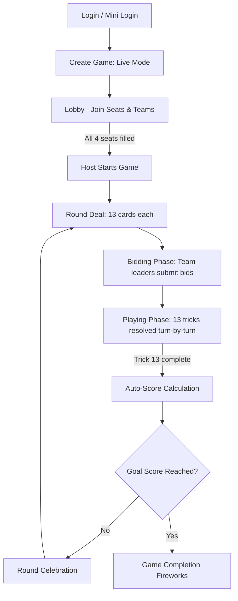

# ASAPDE Game — Product Requirements Document (PRD) [Gemini Edition]

**Product:** ASAPDE — Live Multiplayer Spades PWA  
**Version:** 1.0 (Gemini Spec)  
**Date:** July 2, 2026  
**Status:** Ready for Review  
**Source:** Evolved from [asapde_game_prd.md](file:///d:/dev/spade/deploy_spade/aspade_game/asapde_game_prd.md)  

---

## Table of Contents

1. [Executive Summary](#1-executive-summary)
2. [Problem Statement & Vision](#2-problem-statement--vision)
3. [Core User Personas](#3-core-user-personas)
4. [Current State vs Target State](#4-current-state-vs-target-state)
5. [User Journeys & State Machine](#5-user-journeys--state-machine)
6. [Interactive Mobile GUI Mockups](#6-interactive-mobile-gui-mockups)
7. [Feature Requirements (P0/P1/P2)](#7-feature-requirements)
8. [Game Rules & Server-Authoritative Engine](#8-game-rules--server-authoritative-engine)
9. [Visual Design System & UX Standards](#9-visual-design-system--ux-standards)
10. [Technical Architecture & State Sync](#10-technical-architecture--state-sync)
11. [Data Model Schema](#11-data-model-schema)
12. [Open Questions & Gemini Recommendations](#12-open-questions--gemini-recommendations)
13. [Appendix A — Implementation Checklist](#appendix-a--implementation-checklist)

---

## 1. Executive Summary

ASAPDE Game evolves the existing **Spades score-tracking mobile web app** into a **fully playable, real-time multiplayer Spades experience** delivered as an installable **Progressive Web App (PWA)**. 

Players will sit at a virtual card table, play actual hands with enforced Spades rules, talk to each other via live voice chat, and retain every social/scoring feature they already love from the mobile version: team games, bidding, trick tracking, round celebrations, leaderboards, game history, resume/extend, and host controls.

**North Star:** *"Friday night Spades at the kitchen table — on your phone, anywhere."*

---

## 2. Problem Statement & Vision

### Today (Mobile Score Tracker)
The current app (`aspade_railway/front`) excels at managing the meta-game (creating games, lobby management, manual bidding, manual trick-count entry, and score calculation). However, players still need a physical deck of cards (or a secondary card-playing site) to actually play. There is no authoritative game engine, card table, real-time play sync, or voice chat in ASAPDE.

### Tomorrow (Full Game PWA)
We are building a unified, immersive platform that:
1. Deals cards and automatically enforces correct Spades rules.
2. Syncs every card play and turn transition in real time (<500ms broadcast-to-render latency).
3. Integrates low-latency voice rooms directly in the browser so players can "table talk" as if they were in the same room.
4. Behaves like a native app (installable PWA with offline static shell caching).
5. Provides a seamless manual-fallback mode for players who still prefer physical cards but want to use the score tracking.

---

## 3. Core User Personas

*   **P1: The Organizer (Host):** Sets up games, distributes links, balances teams, and needs quick host-override controls if a player goes offline.
*   **P2: The Kitchen Table Veteran (Regular):** Knows Spades rules inside out, plays one-handed on mobile, expects visual round celebrations, and wants clear visibility of scores and tricks won.
*   **P3: The Quick-Join Friend (Casual):** Joins via shared link, wants instant login (name only) without registration friction, and expects a responsive, modern UI.
*   **P4: The Scorekeeper (Manual Mode):** Wants to play with physical cards but use ASAPDE for scoreboard automation.

---

## 4. Current State vs Target State

| Area | Mobile Today | Target (Full Game) |
| :--- | :--- | :--- |
| **Play Model** | Manual trick-count entry | Server-authoritative game engine + manual fallback |
| **Sync Protocol** | HTTP Polling | Supabase Realtime (WebSockets) + smart polling fallback |
| **Lobby & Teams** | Grid layout, team colors | Modernized glassmorphic cards, team seat selection |
| **Play Table** | Simple forms | 4-seat interactive virtual card table with animations |
| **Voice Chat** | External (Discord, Zoom) | Integrated LiveKit voice channels per game room |
| **Connectivity** | Standard browser tab | Installable PWA with local asset caching & service worker |

---

## 5. User Journeys & State Machine

### J1 — Create & Play Live Game (Happy Path)



### J2 — Reconnection Protocol
If a player loses connection during a live play:
1. UI displays a **"Reconnecting..."** badge.
2. The game state is stored securely in PostgreSQL.
3. Upon reconnection, the client requests the latest state snapshot via `GET /api/game/[id]`.
4. The server returns the private card hand, public table cards, current turn index, and voice token.
5. If the turn timer expires before the player reconnects, the engine auto-plays the lowest legal card (if host enabled) to keep the game moving.

---

## 6. Interactive Mobile GUI Mockups

Below are the mockups representing the target mobile experience.

### 6.1 The Live Card Table (Mobile-First)

Here is the high-fidelity mock-up of the Live Card Table interface. It showcases:
*   **4-Seat Circular Layout:** Optimized for vertical screens, placing the active player's hand at the bottom, their partner at the top, and opponents on the left and right.
*   **Glassmorphic Play Area:** The center pile shows the 4 cards currently in play, highlighting the winning card.
*   **Glossy Card Styles:** The player's cards are sorted by suit and rank, with legal cards fully colored and illegal cards faded.
*   **Voice Integration Indicator:** Small visual avatars with speaking indicators showing active table talk.


*Figure 6.1: Live Card Table layout displaying player cards, trick area, and live stats.*

---

### 6.2 The Game Lobby & Team Selection

Below is the design structure for the pre-game lobby where players organize into teams.

```
+-------------------------------------------------------------+
|  <- BACK                GAME LOBBY: Room #941               |
+-------------------------------------------------------------+
|                                                             |
|   INVITE LINK                                               |
|   [ asapde.com/join/941         ] [ COPY LINK ]             |
|                                                             |
|   +-----------------------------------------------------+   |
|   | TEAM NORTH / SOUTH                     [CYAN]       |   |
|   | - @Host (P1) - Sitting North                        |   |
|   | - @Partner (P2) - Sitting South                     |   |
|   +-----------------------------------------------------+   |
|                                                             |
|   +-----------------------------------------------------+   |
|   | TEAM EAST / WEST                       [ORANGE]     |   |
|   | - @Opponent1 (P3) - Sitting East                    |   |
|   | - [ EMPTY SEAT ]                       [ JOIN SEAT] |   |
|   +-----------------------------------------------------+   |
|                                                             |
|   VOICE CHAT PREVIEW                                        |
|   [x] Auto-join voice room (muted by default)               |
|                                                             |
|   CONNECTED PLAYERS (3/4)                                   |
|   (o) @Host      [Mic Enabled]                              |
|   (o) @Partner   [Mic Muted]                                |
|   (o) @Opponent1 [Mic Muted]                                |
|                                                             |
|   +-----------------------------------------------------+   |
|   |         WAITING FOR 1 MORE PLAYER...                |   |
|   |         (Start button activates at 4/4)             |   |
|   +-----------------------------------------------------+   |
+-------------------------------------------------------------+
```

*Figure 6.2: Mobile lobby with team seats, invite tools, and status displays.*

#### Lobby CSS Grid Structure:
*   **Header:** Standard `flex justify-between items-center px-4 py-3 bg-neutral-900 border-b border-neutral-800`.
*   **Invite Section:** Card layout using `bg-neutral-900/60 backdrop-blur-md border border-neutral-800 p-4 rounded-xl`.
*   **Team Cards:** Two responsive blocks using CSS Grid `grid grid-cols-1 md:grid-cols-2 gap-4`. Glow transitions on hover.
*   **Start Button:** Pill-shaped, fixed at the bottom with a shadow-pulse animation:
    ```css
    .start-btn-disabled {
      background: linear-gradient(135deg, #1e293b, #0f172a);
      color: #64748b;
      cursor: not-allowed;
    }
    .start-btn-active {
      background: linear-gradient(135deg, #00f2fe, #4facfe);
      box-shadow: 0 0 15px rgba(79, 172, 254, 0.4);
      color: #ffffff;
      animation: pulseGlow 2s infinite;
    }
    ```

---

## 7. Feature Requirements

### 7.1 Play Controls & Interactions (Live Mode)
*   **TABLE-01 [P0]:** sorted 13-card hand display. Swipe left/right to browse.
*   **TABLE-02 [P0]:** legal play validation (cards matching leading suit glow green; others are dimmed to 35% opacity).
*   **TABLE-03 [P0]:** Play interaction via **Double Tap** (speeds up mobile flow) or **Drag-and-Drop** into the center circle.
*   **TABLE-04 [P1]:** "Spades Broken" event notification using a center screen banner with a flash animation.

### 7.2 Voice Chat Room
*   **VOICE-01 [P1]:** Automatic token exchange via `/api/voice/token` connecting players to a LiveKit Room.
*   **VOICE-02 [P1]:** Global Mute/Unmute floating button at the top-right corner of the table.
*   **VOICE-03 [P2]:** Live visual speaking indicators (animated waveform SVG rings around active speaker's seat).

---

## 8. Game Rules & Server-Authoritative Engine

To prevent cheating and client-side desync, the entire deck generation, shuffling, card deal, and trick resolution is executed server-side.

1.  **Deals:** At the start of a round, the server uses a secure random Fisher-Yates shuffle. 13 cards are stored in memory for each player. The API filters the hand data, sending only the player's own cards to their client.
2.  **Turn Validation:**
    *   The first trick must be led by the player to the left of the dealer.
    *   Subsequent tricks are led by the winner of the previous trick.
    *   Players must follow suit if they hold matching cards.
    *   Spades can only be led once they have been "broken" (played as a trump card on a non-spade trick), or if the player has nothing but spades in their hand.
3.  **Trick Resolution:** Once 4 cards are in the center, the server determines the winning card, increments the trick count for the winning seat, notifies clients with `TRICK_WON`, and sets `currentTurn` to the winning player.

---

## 9. Visual Design System & UX Standards

The ASAPDE design language is built around a dark, high-contrast palette inspired by physical card tables under dramatic spotlight conditions:

### Color Palette (HSL-based tokens)
*   **Background (Felt Deep):** `hsl(222, 47%, 11%)` to `hsl(222, 47%, 6%)` (Gradient)
*   **Glass Surface:** `hsla(217, 33%, 17%, 0.6)` with backdrop filter `blur(12px)`
*   **Accent Color Cyan (US/North-South):** `hsl(190, 100%, 50%)`
*   **Accent Color Orange (THEM/East-West):** `hsl(25, 95%, 53%)`
*   **Active Turn Glow:** `hsl(142, 70%, 45%)` (Vibrant Emerald)

### Typography
*   Primary Font: **Inter** or **Outfit** (Sans-Serif)
*   Weights: Regular (400) for cards, Semibold (600) for player names, Bold (700) for scores.

---

## 10. Technical Architecture & State Sync

```
                    +------------------------------------+
                    |        Client (Mobile PWA)         |
                    +---+------------+--------------+----+
                        |            |              |
           HTTPS Bids   |            | LiveKit RT   | Realtime Events
           & Card Plays |            | Voice Audio  | (WebSocket)
                        v            v              v
                  +-----+----+  +----+----+   +-----+------+
                  | Next.js  |  | LiveKit |   |  Supabase  |
                  | API      |  | Cloud   |   |  Realtime  |
                  +-----+----+  +---------+   +-----+------+
                        |                           |
                        +------------+--------------+
                                     |
                                     v
                             +-------+--------+
                             |  PostgreSQL    |
                             |  (Game Store)  |
                             +----------------+
```

### Protocol Logic:
*   **Primary Sync:** All card plays, turn indicators, and scores are broadcast through Supabase Realtime broadcast channels.
*   **Fallback Sync:** If the WebSocket connection fails, the client triggers a smart polling hook (`useGamePoller`) which performs a lightweight GET request `/api/game/[id]/status` at adaptive intervals:
    *   *Lobby/Bidding:* 5-second interval.
    *   *Card Play (Active Turn):* 1.5-second interval.
    *   *Card Play (Inactive Turn):* 4-second interval.

---

## 11. Data Model Schema

We expand the existing PostgreSQL schema with columns for the `live_state` JSON block:

```typescript
export interface Card {
  suit: 'S' | 'H' | 'D' | 'C'; // Spades, Hearts, Diamonds, Clubs
  value: number;               // 2-14 (11=J, 12=Q, 13=K, 14=A)
  code: string;                // e.g. "AS" (Ace of Spades), "10D" (10 of Diamonds)
}

export interface Trick {
  leadSuit: 'S' | 'H' | 'D' | 'C' | null;
  plays: Array<{
    playerId: string;
    card: Card;
    playedAt: string;
  }>;
  winnerPlayerId: string | null;
}

export interface LiveGameState {
  phase: 'dealing' | 'bidding' | 'playing' | 'round_end';
  dealerSeat: number;          // 0 to 3
  currentTurn: string | null;   // playerId
  turnExpiresAt: string | null; // ISO timestamp for timer alerts
  spadesBroken: boolean;
  currentTrick: Trick;
  completedTricks: Trick[];
  hands: Record<string, Card[]>; // Server-only, stripped in client payload
  seats: Record<string, number>; // playerId -> 0..3 (0=South, 1=East, 2=North, 3=West)
}
```

---

## 12. Open Questions & Gemini Recommendations

To ensure rapid delivery, we address the original open questions with concrete design recommendations:

### Q1: Sandbagging rules (Double-Back Penalties) - v1 or v1.1?
*   **Gemini Recommendation:** Include sandbagging (overtrick tracking) in **v1**. Since we already track tricks in the manual database schema, appending the bag count calculation to the final scorer logic is a low-effort task that significantly increases rules correctness. 10 bags result in a -100 point penalty.

### Q2: 2-player games in live mode - Bot support?
*   **Gemini Recommendation:** Block live game start until all 4 seats are occupied. Adding bots requires designing card-playing heuristics that increase code complexity. We should prioritize a flawless 4-player social experience for v1, and place BOT-support on the v1.2 roadmap.

### Q3: Turn timer auto-play behavior?
*   **Gemini Recommendation:** Enable by default, set to 25 seconds per turn. If the timer expires, the server automatically plays the **lowest legal card** in the player's hand. This keeps the table active. The host can toggle this setting off in the Lobby Settings.

### Q4: Monorepo vs Greenfield folder structure?
*   **Gemini Recommendation:** Evolve `aspade_railway/front` in place. Re-using the styling, global themes, helper utilities, and database connections is much faster than setting up a fresh codebase. We will organize the new files under an `aspade_game` folder inside the current repository.

---

## 13. Appendix A — Implementation Checklist

### [ ] Phase 1: Engine & API Setup
- [ ] Implement `engine/deck.ts` and `engine/legal-plays.ts`.
- [ ] Create `/api/action` endpoint for player card plays and bids.
- [ ] Write integration test cases for full 13-trick round execution.

### [ ] Phase 2: Live Card Table UI
- [ ] Build the circular 4-seat CSS Grid table interface.
- [ ] Implement card dragging and double-tap actions.
- [ ] Integrate Supabase Realtime channel bindings.

### [ ] Phase 3: LiveKit Voice Integration
- [ ] Integrate `@livekit/components-react` inside the header control.
- [ ] Implement speaking indicator waveform halos on seats.

---

*Document owner: Engineering / Gemini AI*  
*Next review: Post-design signoff*
