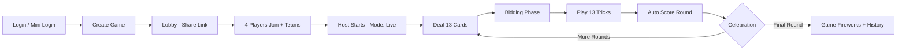
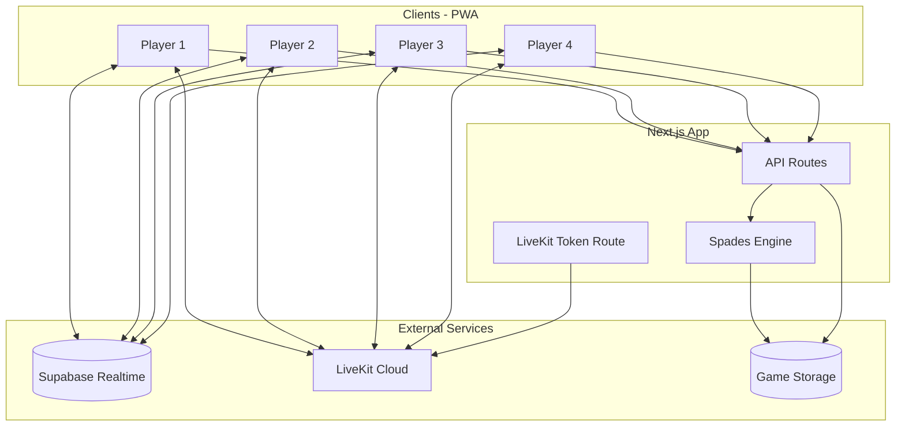

# ASAPDE Game — Product Requirements Document (PRD)

**Product:** ASAPDE — Live Multiplayer Spades PWA  
**Version:** 1.0  
**Date:** July 2, 2026  
**Status:** Draft  
**Source:** Derived from `fullgame_plan.md` and mobile score-tracker (`aspade_railway/front`)

---

## Table of Contents

1. [Executive Summary](#1-executive-summary)
2. [Problem Statement](#2-problem-statement)
3. [Product Vision & Goals](#3-product-vision--goals)
4. [User Personas](#4-user-personas)
5. [Current State vs Target State](#5-current-state-vs-target-state)
6. [User Journeys](#6-user-journeys)
7. [Feature Requirements](#7-feature-requirements)
8. [Game Rules & Engine](#8-game-rules--engine)
9. [UI/UX Requirements (Mobile-First)](#9-uiux-requirements-mobile-first)
10. [Technical Architecture](#10-technical-architecture)
11. [Data Model](#11-data-model)
12. [Non-Functional Requirements](#12-non-functional-requirements)
13. [Phased Delivery Roadmap](#13-phased-delivery-roadmap)
14. [Success Metrics & KPIs](#14-success-metrics--kpis)
15. [Risks & Mitigations](#15-risks--mitigations)
16. [Open Questions](#16-open-questions)
17. [Appendix A — Mobile Feature Parity Checklist](#appendix-a--mobile-feature-parity-checklist)
18. [Appendix B — Glossary](#appendix-b--glossary)

---

## 1. Executive Summary

ASAPDE Game evolves the existing **Spades score-tracking mobile web app** into a **fully playable, real-time multiplayer Spades experience** delivered as an installable **Progressive Web App (PWA)**.

Players will sit at a virtual card table, play actual hands with enforced Spades rules, talk to each other via live voice chat, and retain every social/scoring feature they already love from the mobile version: team games, bidding, trick tracking, round celebrations, leaderboards, game history, resume/extend, and host controls.

**North Star:** *"Friday night Spades at the kitchen table — on your phone, anywhere."*

---

## 2. Problem Statement

### Today (Mobile Score Tracker)

The current app (`aspade_railway/front`) excels at:

- Creating and joining games via shareable links
- Team configuration, lobby management, and host controls
- Bidding and manual trick-count entry
- Scoring, leaderboards, round celebrations, and game history
- Mobile-optimized UX (safe areas, touch scroll, session recovery, iOS Chrome handling)

**Gap:** Players still play physical cards (or another app) and only use ASAPDE to **track** bids, tricks, and scores. There is no authoritative game engine, no card table, no real-time play sync, and no voice chat.

### Tomorrow (Full Game PWA)

Players need a single app that:

1. Deals cards and enforces Spades rules automatically
2. Syncs every play in real time across 4 seats
3. Supports voice chat for the social "table talk" experience
4. Installs to the home screen like a native app
5. Preserves 100% of existing score-tracker workflows as a **fallback/manual mode**

---

## 3. Product Vision & Goals

### Vision

Transform ASAPDE from a score companion into the **default way friends play Spades online** — fast to start, mobile-first, socially rich, and rule-correct.

### Primary Goals

| # | Goal | Measure |
|---|------|---------|
| G1 | Play a complete 4-player Spades hand end-to-end online | 13 tricks resolved per round without manual entry |
| G2 | Match mobile score-tracker feature parity | All Appendix A items pass acceptance tests |
| G3 | Sub-second perceived sync for card plays | < 500ms p95 broadcast-to-render |
| G4 | Installable PWA on iOS and Android | Lighthouse PWA score ≥ 90 |
| G5 | Graceful reconnect after brief disconnect | Player rejoins same seat within 60s |

### Non-Goals (v1)

- AI/bot opponents (future)
- Cash prizes or real-money gambling
- Native iOS/Android store apps (PWA only for v1)
- Video chat (voice only for v1)
- Tournament brackets / league management (future)

---

## 4. User Personas

### P1 — The Host ("Friday Night Organizer")

- Creates games, picks teams, shares links via text/WhatsApp
- Wants fast setup, clear lobby, ability to extend games
- Often on iPhone Chrome; needs reliable session persistence

### P2 — The Regular ("Kitchen Table Veteran")

- Knows Spades rules; plays weekly with the same crew
- Wants visible bids, team colors, celebrations when winning a round
- Uses phone one-handed; expects large tap targets

### P3 — The Casual ("Invited Friend")

- Joins via quick link; may not have an account
- Needs mini-login (name only), team picker, simple instructions
- May drop connection; must rejoin without losing seat

### P4 — The Scorekeeper ("Manual Mode User")

- Prefers physical cards but digital scoring (current behavior)
- Must be able to run **manual/score-only mode** without live cards

---

## 5. Current State vs Target State

| Area | Mobile Today | Target (Full Game) |
|------|--------------|-------------------|
| **Play model** | Manual bid/trick entry | Server-authoritative card engine + optional manual mode |
| **Sync** | HTTP polling (`GamePoller`) | Supabase Realtime WebSockets + polling fallback |
| **Table UI** | Form-based bidding/trick screens | 4-seat virtual table with animated cards |
| **Voice** | None | LiveKit voice rooms per game |
| **Install** | Browser tab | PWA (standalone, offline asset cache) |
| **Lobby/Teams** | Full featured | Retained as-is |
| **Scoring/Celebrations** | Full featured | Retained; auto-populated from engine |
| **History/Dashboard** | Full featured | Retained |
| **Admin** | Storage, games, players | Retained |

---

## 6. User Journeys

### J1 — Create & Play Live Game (Happy Path)



1. Host logs in → Create Game → configures teams, rounds, **play mode: Live**
2. Shares `/quick-join/{gameId}` link
3. Players join, pick/auto-assign teams, team leaders confirmed
4. Host taps **Start Game** → engine shuffles, deals, sets phase = `bidding`
5. Team leaders submit bids (visible/hidden per config)
6. Phase = `playing` → turn-based card play on virtual table
7. After 13 tricks → engine computes tricks won → phase = `scoring`
8. Round celebration → host advances → repeat until `totalRounds`
9. Game completion fireworks → saved to history

### J2 — Join via Quick Link (Mobile)

1. Player opens link on phone
2. Mini-login modal if no session
3. Team selection modal if team game
4. Lands in lobby; session saved for iOS Chrome recovery
5. Auto-scroll to bid/trick controls on their turn (existing mobile behavior)

### J3 — Reconnect Mid-Game

1. Player loses connection (tunnel, tab backgrounded)
2. App shows disconnected badge; polling/realtime retries
3. On reconnect: fetch authoritative state, restore hand, resume turn timer
4. If > 60s: seat marked `away`; host can pause or replace (v1.1)

### J4 — Manual / Score-Only Mode (Parity)

1. Host creates game with **play mode: Manual** (current behavior)
2. Physical cards played offline
3. App flows: Lobby → Bidding → Trick Tracking → Trick Review → Leaderboard
4. All existing screens and host edit controls work unchanged

### J5 — Extend Game After Final Round

1. Final round completes → celebration
2. Host sees **Extend Game** dialog (existing)
3. Adds N rounds → players notified → continues from next round

---

## 7. Feature Requirements

Features are tagged: **P0** (must ship), **P1** (should ship), **P2** (nice to have).

### 7.1 Authentication & Player Identity

| ID | Feature | Priority | Notes |
|----|---------|----------|-------|
| AUTH-01 | Player name login (no password) | P0 | Match `login-screen.tsx` |
| AUTH-02 | Mini-login modal in-game | P0 | Match `mini-login-modal.tsx` |
| AUTH-03 | Session persistence (localStorage + server) | P0 | iOS Chrome session manager |
| AUTH-04 | Player profile (games played, win rate, avatar) | P1 | Match dashboard stats |
| AUTH-05 | Name autocomplete / suggestions | P1 | `/api/players/suggestions` |

### 7.2 Dashboard & Navigation

| ID | Feature | Priority | Notes |
|----|---------|----------|-------|
| DASH-01 | Active games list with live status | P0 | |
| DASH-02 | Resume game button | P0 | No time limit on resume |
| DASH-03 | Game history cards | P0 | |
| DASH-04 | Global leaderboard link | P1 | |
| DASH-05 | Game statistics component | P1 | Win/loss, bid accuracy |
| DASH-06 | Notification center | P1 | In-app + browser notifications |
| DASH-07 | Mobile recovery banner | P0 | `mobile-recovery.tsx` |

### 7.3 Game Creation

| ID | Feature | Priority | Notes |
|----|---------|----------|-------|
| CREATE-01 | Auto-generated game title | P0 | |
| CREATE-02 | Total rounds (default 13) | P0 | |
| CREATE-03 | Card progression mode (increasing/decreasing/fixed) | P0 | Affects tricks-per-round in variant modes |
| CREATE-04 | Bidding style: visible / hidden | P0 | |
| CREATE-05 | Scoring system: standard | P0 | Sandbag rules configurable v1.1 |
| CREATE-06 | Game mode: teams / individual | P0 | |
| CREATE-07 | Team config: count, names, colors, auto-assign | P0 | 32 team names, 12 colors |
| CREATE-08 | Max players | P0 | 2–8 |
| CREATE-09 | Optional timers (bid timer, turn timer) | P1 | |
| CREATE-10 | Game description | P2 | |
| CREATE-11 | **Play mode: Live / Manual** | P0 | **New** — selects engine vs tracker |

### 7.4 Lobby

| ID | Feature | Priority | Notes |
|----|---------|----------|-------|
| LOBBY-01 | Player list with host badge | P0 | |
| LOBBY-02 | Copy/share game link | P0 | WhatsApp, Facebook, native share |
| LOBBY-03 | Team assignment UI | P0 | |
| LOBBY-04 | Promote to team leader | P0 | |
| LOBBY-05 | Host start game (min 2 players) | P0 | Live mode requires 4 for full table |
| LOBBY-06 | Exit game / leave lobby | P0 | |
| LOBBY-07 | Online presence indicators | P1 | Supabase Presence |
| LOBBY-08 | Voice chat pre-game toggle | P1 | Join muted |

### 7.5 Live Card Table (New)

| ID | Feature | Priority | Notes |
|----|---------|----------|-------|
| TABLE-01 | 4-seat layout: bottom=self, top=partner, sides=opponents | P0 | |
| TABLE-02 | Render player's 13-card hand, sorted suit/rank | P0 | |
| TABLE-03 | Tap or drag card to play | P0 | Double-tap shortcut |
| TABLE-04 | Highlight legal plays | P0 | Follow suit, spades broken rules |
| TABLE-05 | Center trick area (4 cards) | P0 | |
| TABLE-06 | Turn indicator + timer | P0 | |
| TABLE-07 | Trick winner animation | P1 | framer-motion |
| TABLE-08 | Spades broken notification | P0 | |
| TABLE-09 | Nil / blind nil bid support | P1 | |
| TABLE-10 | Card deal animation | P1 | |
| TABLE-11 | Sound effects: shuffle, play, win trick | P1 | Web Audio API |
| TABLE-12 | Spectator mode (8-player team games) | P2 | Non-leaders watch |

### 7.6 Bidding Phase

| ID | Feature | Priority | Notes |
|----|---------|----------|-------|
| BID-01 | Team leader submits bid for team | P0 | Match mobile behavior |
| BID-02 | Individual bidding mode | P0 | |
| BID-03 | Visible vs hidden bids | P0 | |
| BID-04 | Team total bid display | P0 | |
| BID-05 | Auto-scroll to bid UI on mobile | P0 | |
| BID-06 | Host force-advance bidding | P1 | |
| BID-07 | Live mode: auto-advance when all bids in | P0 | |

### 7.7 Trick Play & Review

| ID | Feature | Priority | Notes |
|----|---------|----------|-------|
| TRICK-01 | **Live:** engine resolves tricks | P0 | |
| TRICK-02 | **Manual:** trick count entry per player | P0 | `trick-tracking-screen.tsx` |
| TRICK-03 | Trick review modal (host approve/edit) | P0 | Manual mode |
| TRICK-04 | Running trick count per team/player | P0 | |
| TRICK-05 | Auto-advance to scoring after trick 13 | P0 | Live mode |

### 7.8 Scoring & Leaderboard

| ID | Feature | Priority | Notes |
|----|---------|----------|-------|
| SCORE-01 | Standard Spades scoring (bid ± tricks) | P0 | |
| SCORE-02 | Team and individual scoreboards | P0 | |
| SCORE-03 | Round-by-round score grid | P0 | |
| SCORE-04 | Round celebration animation | P0 | Win/lose sounds |
| SCORE-05 | Game completion fireworks | P0 | |
| SCORE-06 | Host: edit round scores | P0 | |
| SCORE-07 | Host: extend game (add rounds) | P0 | |
| SCORE-08 | Host: complete game early | P0 | |
| SCORE-09 | Host: edit game rules mid-game | P1 | |
| SCORE-10 | Floating score button (mobile) | P0 | |
| SCORE-11 | Auto-advance to next round (host setting) | P1 | |

### 7.9 Voice Chat (New)

| ID | Feature | Priority | Notes |
|----|---------|----------|-------|
| VOICE-01 | LiveKit room per `gameId` | P1 | |
| VOICE-02 | Mute/unmute toggle | P1 | |
| VOICE-03 | Auto-join on game start (muted by default) | P1 | |
| VOICE-04 | Speaking indicator per player | P2 | |
| VOICE-05 | Opt-out in lobby | P1 | |

### 7.10 Real-Time & Connectivity

| ID | Feature | Priority | Notes |
|----|---------|----------|-------|
| RT-01 | Supabase Realtime channel per game | P0 | |
| RT-02 | Events: CARD_PLAYED, BID_SUBMITTED, TURN_CHANGED, PHASE_CHANGED | P0 | |
| RT-03 | HTTP polling fallback | P0 | Smart intervals per phase |
| RT-04 | Connection status indicator | P0 | connected/connecting/disconnected |
| RT-05 | Exponential backoff on errors | P0 | |
| RT-06 | Idempotent action handling | P0 | Prevent double-plays |

### 7.11 PWA & Installation

| ID | Feature | Priority | Notes |
|----|---------|----------|-------|
| PWA-01 | Web manifest (standalone display) | P0 | |
| PWA-02 | Service worker (Serwist) | P0 | Cache static assets, card images |
| PWA-03 | App icons 192/512 | P0 | |
| PWA-04 | Install prompt UX | P1 | |
| PWA-05 | Offline: show cached shell + reconnect message | P1 | |

### 7.12 Admin

| ID | Feature | Priority | Notes |
|----|---------|----------|-------|
| ADMIN-01 | Admin login | P1 | |
| ADMIN-02 | Games/players management | P1 | |
| ADMIN-03 | Storage config (S3/FTP/local) | P1 | |
| ADMIN-04 | Connection diagnostics | P2 | |

---

## 8. Game Rules & Engine

### 8.1 Core Rules (Standard Spades)

| Rule | Enforcement |
|------|-------------|
| 4 players, 2 teams (partners sit across) | Seat assignment in live mode |
| 52-card deck, 13 cards each | Fisher-Yates shuffle, server deal |
| Spades are trump | |
| Follow suit if possible | Legal play validation |
| Spades cannot be led until broken | Exception: player has only spades |
| Highest led suit wins, unless spade played | Trick resolution |
| Bid tricks per team (team leader) | Bidding phase |
| Score: 10 × bid + 1 per overtrick if made; fail = −10 × bid | Sandbags optional v1.1 |
| Nil: 100 if made, −100 if failed | P1 |
| Game to configured round count | |

### 8.2 Game State Machine

```
lobby → bidding → playing → [trick_review] → scoring → (next round | completed)
                  ↑ manual mode only: trick_review
```

**Live mode:** `trick_review` skipped — engine is source of truth.  
**Manual mode:** existing flow with host review.

### 8.3 Authoritative Server

- All shuffles, deals, play validation, and trick resolution occur **server-side**
- Clients send **intent** (`PLAY_CARD`, `SUBMIT_BID`); server broadcasts **fact**
- Optimistic UI allowed for own plays; rollback on rejection

### 8.4 Turn Order

- Bid order: left of dealer, clockwise
- Play order: trick winner leads next; first trick led by player left of dealer
- Dealer rotates each round

### 8.5 Reconnection Protocol

1. Client reconnects → `GET /api/game/{gameId}` + Realtime resubscribe
2. Server sends full state snapshot including player's private hand
3. If it was player's turn and turn timer expired → auto-play lowest legal card (configurable, P1)

---

## 9. UI/UX Requirements (Mobile-First)

Match and extend patterns from `aspade_railway/front`.

### 9.1 Design Principles

- **Mobile-first:** Design for 375px width; scale up to tablet/desktop
- **One-thumb friendly:** Primary actions in bottom 40% of screen
- **Glanceable state:** Current round, score, whose turn — always visible
- **Celebrate wins:** Round celebrations and fireworks retained
- **Never lose your game:** Session recovery is non-negotiable

### 9.2 Mobile Wrapper Behavior

Reuse `MobileGameWrapper` patterns:

- `mobile-safe-area` padding for notched devices
- Prevent zoom on input focus
- Auto-hide chrome after 2s; show on touch
- Large mobile optimization (≥ 428px width)
- `showMobileNotification()` for lightweight toasts

### 9.3 Screen Map

| Screen | Route | Live | Manual |
|--------|-------|------|--------|
| Login | `/` | ✓ | ✓ |
| Dashboard | `/dashboard` | ✓ | ✓ |
| Create Game | `/create-game` | ✓ | ✓ |
| Join Game | `/join-game`, `/join/[id]`, `/quick-join/[id]` | ✓ | ✓ |
| Game Lobby | `/games/[gameId]` (lobby phase) | ✓ | ✓ |
| Bidding | same | ✓ | ✓ |
| **Card Table** | same (playing phase) | ✓ | — |
| Trick Tracking | same (playing phase) | — | ✓ |
| Leaderboard | same (scoring phase) | ✓ | ✓ |
| History | `/history` | ✓ | ✓ |
| Global Leaderboard | `/leaderboard` | ✓ | ✓ |
| Admin | `/admin` | ✓ | ✓ |

### 9.4 Card Table Layout (Live Mode)

```
                    [ Partner ]
                       ↑
    [ Opponent L ]   TRICK    [ Opponent R ]
                       ↓
                    [ You + Hand ]
              [ Voice ] [ Score ] [ Menu ]
```

- Hand: horizontal scroll or fan layout on small screens
- Legal cards: full color; illegal: dimmed 40%
- Partner/opponent card backs when not their turn

### 9.5 Accessibility

- Minimum tap target 44×44px
- `aria-label` on playable cards
- Color-blind safe team indicators (name + icon, not color alone)
- Reduced motion: respect `prefers-reduced-motion`

### 9.6 Visual Assets

- Card faces: SVG or WebP sprite sheet (cached by service worker)
- Team colors from existing `TEAM_COLORS` palette
- Framer Motion for trick animations (≤ 400ms)

---

## 10. Technical Architecture

### 10.1 Stack (Existing + Additions)

| Layer | Technology |
|-------|------------|
| Framework | Next.js 15, React 18, TypeScript |
| Styling | Tailwind CSS, shadcn/ui, Radix |
| Animation | Framer Motion |
| State sync | Supabase Realtime (primary), HTTP polling (fallback) |
| Storage | Existing file/S3/FTP abstraction |
| Voice | LiveKit (`@livekit/components-react`) |
| PWA | `@serwist/next` |
| Validation | Zod |

### 10.2 System Diagram



### 10.3 Realtime Events

| Event | Payload | Direction |
|-------|---------|-----------|
| `BID_SUBMITTED` | `{ playerId, bid, round }` | Server → All |
| `CARD_PLAYED` | `{ playerId, card, trickIndex }` | Server → All |
| `TRICK_WON` | `{ winnerId, trickCards }` | Server → All |
| `TURN_CHANGED` | `{ playerId, expiresAt }` | Server → All |
| `PHASE_CHANGED` | `{ phase, round }` | Server → All |
| `PLAYER_PRESENCE` | `{ playerId, online }` | Bidirectional |
| `GAME_STATE_SNAPSHOT` | Full state | Server → Client on join |

### 10.4 API Additions

| Endpoint | Method | Purpose |
|----------|--------|---------|
| `/api/action` | POST | Extend: `playCard`, `submitBid` (engine-validated) |
| `/api/voice/token` | POST | LiveKit JWT for `gameId` room |
| `/api/game/[gameId]` | GET | Add: private hand, trick state, phase |

### 10.5 Project Structure (New Modules)

```
aspade_game/
├── engine/
│   ├── deck.ts
│   ├── shuffle.ts
│   ├── legal-plays.ts
│   ├── trick-resolver.ts
│   ├── scorer.ts
│   └── state-machine.ts
├── components/
│   ├── card-table/
│   │   ├── card-table.tsx
│   │   ├── player-hand.tsx
│   │   ├── trick-area.tsx
│   │   └── playing-card.tsx
│   └── voice/
│       └── voice-controls.tsx
└── lib/
    └── realtime.ts
```

---

## 11. Data Model

### 11.1 Game Object Extensions

```typescript
interface Game {
  // --- existing fields retained ---
  id: string
  status: 'lobby' | 'bidding' | 'playing' | 'trick_review' | 'scoring' | 'completed' | 'cancelled'
  playMode: 'live' | 'manual'          // NEW
  players: Record<string, Player>
  rounds: Round[]
  teamConfig?: TeamConfig
  // --- new live fields ---
  liveState?: {
    phase: 'dealing' | 'bidding' | 'playing' | 'round_end'
    dealerSeat: number
    currentTurn: string | null
    turnExpiresAt: number | null
    spadesBroken: boolean
    currentTrick: Trick | null
    completedTricks: Trick[]
    hands: Record<string, Card[]>   // server only; filtered per player in API
    seats: Record<string, number>     // playerId → 0..3
  }
}
```

### 11.2 Player Extensions

```typescript
interface Player {
  // --- existing ---
  id: string
  name: string
  team?: string
  isTeamLeader?: boolean
  isHost?: boolean
  // --- new ---
  seat?: number
  connectionStatus?: 'online' | 'away' | 'offline'
  voiceEnabled?: boolean
}
```

---

## 12. Non-Functional Requirements

| Category | Requirement |
|----------|-------------|
| **Performance** | First Contentful Paint < 2s on 4G; card play sync < 500ms p95 |
| **Scalability** | 500 concurrent games (MVP); horizontal API scaling on Railway |
| **Reliability** | 99.5% uptime; no data loss on round completion |
| **Security** | LiveKit tokens short-lived; server validates all plays; no client-side shuffle |
| **Privacy** | Voice audio not recorded in v1; GDPR-ready name-only accounts |
| **Compatibility** | iOS Safari 16+, Chrome Android 100+, desktop Chrome/Firefox/Edge |
| **iOS Chrome** | Session manager for ITP/localStorage limits |

---

## 13. Phased Delivery Roadmap

### Phase 0 — Foundation (Weeks 1–2)

- [ ] `playMode` flag: manual path unchanged
- [ ] Extract shared types, scoring, team utils from mobile app
- [ ] Supabase Realtime POC (presence + broadcast)
- [ ] PWA manifest + icons

### Phase 1 — Game Engine (Weeks 3–5)

- [ ] Deck, shuffle, deal, seat assignment
- [ ] Legal play validation + trick resolution
- [ ] Bidding + scoring integration
- [ ] State machine + `/api/action` handlers
- [ ] Unit tests for engine (100% rule coverage)

### Phase 2 — Card Table UI (Weeks 6–8)

- [ ] `card-table` components (mobile-first)
- [ ] Tap/drag to play
- [ ] Realtime sync wiring
- [ ] Turn indicators + connection badge
- [ ] Manual mode regression testing

### Phase 3 — Mobile Parity & Polish (Weeks 9–10)

- [ ] Full Appendix A checklist
- [ ] Round celebrations auto-trigger from engine
- [ ] Sound effects + deal/trick animations
- [ ] iOS session recovery with live state
- [ ] Smart polling fallback tuning

### Phase 4 — Voice & PWA (Weeks 11–12)

- [ ] LiveKit integration
- [ ] Mute controls in game header
- [ ] Serwist service worker + offline shell
- [ ] Install prompt

### Phase 5 — Beta & Launch (Weeks 13–14)

- [ ] Load testing 100 concurrent games
- [ ] Bug bash on iOS + Android
- [ ] Analytics events
- [ ] Soft launch to existing player base

---

## 14. Success Metrics & KPIs

| Metric | Target (90 days post-launch) |
|--------|----------------------------|
| Weekly active games | 200+ |
| Live mode adoption | ≥ 60% of new games |
| Game completion rate | ≥ 70% of started games |
| Avg session duration | ≥ 45 min |
| PWA installs | ≥ 25% of returning players |
| Reconnect success | ≥ 95% within 60s |
| Crash/error rate | < 1% of sessions |
| App Store NPS proxy (in-app) | ≥ 40 |

---

## 15. Risks & Mitigations

| Risk | Impact | Mitigation |
|------|--------|------------|
| iOS WebRTC/voice restrictions | High | LiveKit SDK; fallback to no-voice; test Safari early |
| Realtime desync | High | Authoritative server; snapshots on reconnect; idempotent actions |
| iOS PWA limitations | Medium | Document "Add to Home Screen"; persist session aggressively |
| 4-player requirement for live | Medium | Allow 2-player live with bots (P2) or block start until 4 |
| Scope creep from mobile parity | Medium | Appendix A as explicit gate; manual mode for edge cases |
| Cheating (client hacks) | High | Server-only deck and validation |

---

## 16. Open Questions

1. **Sandbagging rules:** Strict (−100 at 10 bags) in v1 or v1.1?
2. **2-player games in live mode:** Support with bots, or lobby-only until 4?
3. **Turn timer auto-play:** Enable by default or host opt-in?
4. **Blind nil:** In scope for P1 or defer?
5. **Monorepo:** Build in `aspade_game/` greenfield or evolve `aspade_railway/front` in place?
6. **Backend:** Keep Next.js API routes only, or split engine to Go/Railway microservice?
7. **Supabase:** Already in `package.json` — confirm project/credentials for Realtime?

---

## Appendix A — Mobile Feature Parity Checklist

Every item must pass before Phase 5 launch.

### Auth & Session
- [ ] Name-based login
- [ ] Mini-login modal in game
- [ ] iOS Chrome session manager
- [ ] Session save/get/clear API

### Dashboard
- [ ] Active games with polling
- [ ] Resume game (no time limit)
- [ ] Game history cards
- [ ] Game detail modal
- [ ] Mobile recovery component

### Create / Join
- [ ] Full create form options (rounds, teams, bidding style, etc.)
- [ ] Quick join link
- [ ] Team selection on join
- [ ] Join with existing name

### Lobby
- [ ] Share link (copy, social)
- [ ] Team display with colors
- [ ] Promote team leader
- [ ] Start / exit game

### Gameplay (Manual)
- [ ] Bidding screen with team leader logic
- [ ] Trick tracking screen
- [ ] Trick review modal
- [ ] Visible/hidden bids

### Scoring
- [ ] Leaderboard screen with round grid
- [ ] Round celebration
- [ ] Game completion fireworks
- [ ] Extend game
- [ ] Edit round scores
- [ ] Complete game early
- [ ] Floating score button
- [ ] Auto-advance rounds (host)

### Mobile UX
- [ ] Mobile game wrapper
- [ ] Auto-scroll to active controls
- [ ] Connection status indicator
- [ ] Smart polling intervals
- [ ] Large mobile layout

### Admin
- [ ] Admin panel
- [ ] Storage settings

---

## Appendix B — Glossary

| Term | Definition |
|------|------------|
| **Bid** | Number of tricks a team/player commits to win |
| **Trick** | One card played by each player; highest wins |
| **Spades broken** | First time a spade is played (trump "opened") |
| **Nil** | Bid of zero tricks; bonus/penalty scoring |
| **Sandbag** | Overtrick beyond bid; may incur penalty |
| **Live mode** | Engine deals and plays cards digitally |
| **Manual mode** | Score tracker only; physical cards |
| **PWA** | Progressive Web App; installable web app |
| **Team leader** | Player who submits bids for the team |

---

*Document owner: Product / Engineering*  
*Next review: After Phase 0 completion*
