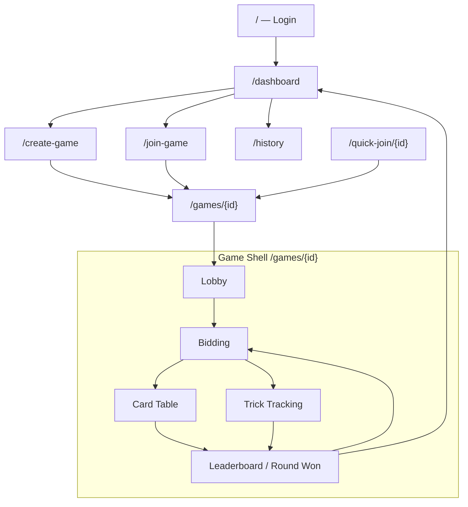

# ASAPDE Game — GUI & Design Plan

**Version:** 1.0  
**Date:** July 3, 2026  
**Status:** Final  
**References:** `design/*.png`, `asapde_game_prd.md`, `Architect.md`, `final_plan.md`

---

## Game Summary for Agents

> **Read this first.** Context for AI agents implementing UI, components, or game flows.

### What is this project?

**ASAPDE** is a **mobile-first Spades card game web app** (Next.js PWA) being upgraded from a **score tracker** into a **full live multiplayer game**. Players create rooms, share invite links, sit at a virtual table, bid, play cards, and track team scores — like a Friday-night kitchen-table Spades game on their phones.

| Item | Value |
|------|-------|
| **Product name** | ASAPDE Game |
| **Card game** | Spades (4 players, 2 teams of 2) |
| **Deployable app** | `aspade_railway/front` (Next.js 15, React, Tailwind, shadcn) |
| **New engine/UI sandbox** | `aspade_game/` (engine, design docs, mockups) |
| **Target** | Installable PWA with realtime sync + optional voice chat |

### What is Spades? (rules agents must know)

Spades is a **trick-taking** card game:

1. **4 players** in **2 partnerships** — partners sit across from each other (North/South vs East/West).
2. Each player gets **13 cards** from a 52-card deck each round.
3. **Bidding:** Before play, each team declares how many **tricks** (rounds of 4 cards) they will win. Team leaders submit the bid in team mode.
4. **Play:** Players take turns playing one card per trick. Must **follow the leading suit** if possible.
5. **Trump:** **Spades** beat all other suits. Spades cannot be **led** until they are **broken** (played when void in the led suit), unless the player holds only spades.
6. **Trick winner:** Highest spade wins, or highest card of the led suit if no spades played.
7. **Scoring:** Make your bid → **+10 × bid** plus **+1 per overtrick**. Miss your bid → **−10 × bid**. Game runs for a configured number of **rounds** (default 13).

### Two play modes (critical for UI routing)

| Mode | `playMode` | What players do | Primary playing UI |
|------|------------|-----------------|-------------------|
| **Manual** | `'manual'` | Play **physical cards** (or elsewhere); app tracks bids/tricks/scores | `TrickTrackingScreen` — enter trick counts |
| **Live** | `'live'` | App **deals and plays cards** digitally with server-enforced rules | `CardTable` — virtual table, tap/drag cards |

**GUI rule:** Lobby, bidding, and scoreboard screens are **shared**. UI **diverges only during the playing phase** — manual shows trick entry; live shows the card table.

### Game flow (screen phases)

```
Login → Dashboard → Create/Join Game → Lobby
  → Bidding (all players submit bids)
  → Playing
       manual: Trick Tracking → Trick Review (host)
       live:   Card Table (13 tricks, server-driven)
  → Scoring / Leaderboard → Round Celebration
  → (repeat rounds) → Game Complete (fireworks) → History
```

**Host powers:** start game, extend rounds, edit scores, complete early, promote team leader.  
**Session:** name-only login (no password); `playerId` + `gameId` persisted for reconnect (especially iOS Chrome).

### Teams & seats (live table layout)

UI **always renders the current player at the bottom (South)**. Partner on top (North). Opponents left/right (West/East).

```
           [ Partner / North ]
[ Opp W ]    TRICK AREA     [ Opp E ]
           [ You / South ]
              YOUR HAND
```

Each seat shows: avatar, name, **Bid**, **Books** (tricks won this round), turn timer, voice indicator.

### Key terminology

| Term | Meaning |
|------|---------|
| **Bid** | Tricks a team commits to win this round |
| **Book / Trick** | One card from each player; highest wins |
| **Trick area** | Center of table where 4 played cards appear |
| **Spades broken** | First time a spade is played — spades may now be led |
| **Round** | One deal of 13 tricks; game has many rounds |
| **Team leader** | Player who submits bids for the team |
| **Books** | Tricks won so far (mockups label this on seat cards) |

### Visual direction (this document's job)

Mockups in `aspade_game/design/` define the target look:

- **Dark glassmorphism** — frosted panels on charcoal/purple backgrounds
- **Neon accents** — **cyan** = your team (US), **orange** = opponents (THEM)
- **Emerald glow** = active turn
- **Gold** = round victory headlines

Existing app uses slate/shadcn defaults; new work **layers this neon/glass skin** without breaking manual-mode screens.

### Related docs (read when implementing)

| Doc | Purpose |
|-----|---------|
| `asapde_game_prd.md` | Full product requirements |
| `plan/final_plan.md` | Phased execution timeline |
| `plan/Architect.md` | Layers, API, engine splits |
| `design/*.png` | High-fidelity screen mockups |
| `aspade_railway/front/components/` | Existing screens to reuse/restyle |

### Agent implementation checklist

When building UI for this game, ensure:

- [ ] Mobile-first: `100dvh`, safe-area insets, 44px tap targets
- [ ] Respect `playMode` — never show card table in manual mode
- [ ] Live mode requires **4 players** to start
- [ ] Never expose opponent card hands in UI (server sends `myHand` only)
- [ ] Turn indicator + legal/illegal card styling on live table
- [ ] Reuse existing celebrations (`round-celebration`, `game-completion-fireworks`)
- [ ] Match team colors + icons (not color alone — accessibility)

---

## Table of Contents

0. [Game Summary for Agents](#game-summary-for-agents)
1. [Design Vision](#1-design-vision)
2. [Design Language](#2-design-language)
3. [Design Tokens](#3-design-tokens)
4. [Navigation & Screen Map](#4-navigation--screen-map)
5. [Screen Specifications](#5-screen-specifications)
6. [Component Library](#6-component-library)
7. [Playing Card System](#7-playing-card-system)
8. [Interaction & Gesture Spec](#8-interaction--gesture-spec)
9. [Motion & Animation](#9-motion--animation)
10. [Feedback & States](#10-feedback--states)
11. [Voice UI](#11-voice-ui)
12. [Manual vs Live UI](#12-manual-vs-live-ui)
13. [Responsive Layout](#13-responsive-layout)
14. [Accessibility](#14-accessibility)
15. [Asset Production List](#15-asset-production-list)
16. [GUI Implementation Phases](#16-gui-implementation-phases)

---

## 1. Design Vision

### North Star

> *"Friday night at the kitchen table — on your phone, anywhere."*

The UI should feel like sitting at a **premium card table under neon lounge lighting**: dark, immersive, tactile, and socially alive. Players should instantly know whose turn it is, what the score is, and who is talking — without reading paragraphs of text.

### Design Pillars

| Pillar | Meaning | GUI expression |
|--------|---------|----------------|
| **Table-first** | The game is the hero | Card table fills 70%+ of live play screen |
| **Glanceable** | One look = full context | Scores, bids, turn timer always visible |
| **Tactile** | Cards feel physical | Tap, drag, fan layout, motion on play |
| **Social** | Voice + presence matter | Avatars, speaking rings, lobby status |
| **Celebratory** | Wins feel earned | Round won screen, fireworks, sound |
| **Forgiving** | Mobile life happens | Reconnect badge, session recovery, large taps |

### Visual Direction (from mockups)

The approved mockups in `aspade_game/design/` define the **target aesthetic**:

- **Dark glassmorphism** — frosted panels on deep charcoal/purple backgrounds
- **Neon accent system** — cyan (your team) vs orange (opponents)
- **Glowing borders** — active turn, winning card, live game cards
- **Rounded everything** — cards, panels, buttons (12–24px radius)
- **Premium card faces** — glossy, suit-colored, high contrast

**Evolution note:** The existing app (`aspade_railway/front`) uses slate gradients and shadcn defaults. GUI work **layers the neon/glass skin on top** of existing layouts — not a full rewrite of working screens in Phase 0–1.

---

## 2. Design Language

### 2.1 Mood board keywords

`Neon lounge` · `Glass table` · `Kitchen table Spades` · `Mobile-native` · `Team colors` · `Celebration`

### 2.2 Do / Don't

| Do | Don't |
|----|-------|
| High contrast text on dark surfaces | Light gray text on dark gray |
| Team color + icon + name (color-blind safe) | Color-only team identification |
| One primary action per screen bottom | Multiple competing CTAs |
| Animate card plays, not entire page | Full-screen transitions every trick |
| Show connection status subtly | Block gameplay with modal on blip |
| Use `100dvh` full-screen game shell | Use `100vh` on iOS (address bar bug) |

### 2.3 Mockup reference index

| File | Screen | Priority |
|------|--------|----------|
| `design/spades_dashboard_*.png` | Home / dashboard | P1 polish |
| `design/spades_game_lobby_*.png` | Pre-game lobby | P0 |
| `design/spades_bidding_*.png` | Bidding phase | P0 |
| `design/spades_card_table_*.png` | **Live play table** | **P0 — hero screen** |
| `design/spades_scoreboard_*.png` | Round won / leaderboard | P0 |

---

## 3. Design Tokens

### 3.1 Color palette

```css
/* ── Backgrounds ── */
--felt-deep:        hsl(222, 47%, 6%);      /* page base */
--felt-mid:         hsl(222, 47%, 11%);     /* gradient mid */
--surface-glass:    hsla(217, 33%, 17%, 0.6);
--surface-elevated: hsla(217, 33%, 22%, 0.85);

/* ── Team accents (from mockups) ── */
--team-us:          hsl(190, 100%, 50%);    /* cyan — North/South, your team */
--team-them:        hsl(25, 95%, 53%);     /* orange — East/West, opponents */

/* ── Semantic ── */
--turn-active:      hsl(142, 70%, 45%);    /* emerald glow — your turn */
--win-gold:         hsl(45, 93%, 58%);      /* "ROUND WON!" headlines */
--success:          hsl(142, 71%, 45%);
--danger:           hsl(0, 84%, 60%);
--warning:          hsl(38, 92%, 50%);

/* ── Text ── */
--text-primary:     hsl(210, 40%, 98%);
--text-secondary:   hsl(215, 20%, 65%);
--text-muted:       hsl(215, 16%, 47%);

/* ── Card suits ── */
--suit-spade:       hsl(210, 40%, 96%);
--suit-club:        hsl(142, 50%, 55%);
--suit-heart:       hsl(0, 85%, 60%);
--suit-diamond:     hsl(0, 85%, 60%);

/* ── Table ── */
--table-border-glow: linear-gradient(135deg, var(--team-us), hsl(270, 80%, 60%));
--trick-zone-bg:    hsla(222, 47%, 8%, 0.9);
```

### 3.2 Tailwind mapping (implement in `tailwind.config`)

```typescript
colors: {
  felt: { DEFAULT: '#0a0f1a', mid: '#0f172a' },
  team: { us: '#00e5ff', them: '#f97316' },
  turn: { active: '#22c55e' },
  win: { gold: '#facc15' },
}
```

### 3.3 Typography

| Role | Font | Weight | Size (mobile) |
|------|------|--------|---------------|
| Display / victory | **Outfit** or Inter | 700 | 28–32px |
| Screen title | Inter | 600 | 18–20px |
| Player name | Inter | 600 | 14px |
| Stats / labels | Inter | 500 | 11–12px uppercase tracking-wide |
| Card rank | Inter | 700 | 18px on card face |
| Body | Inter | 400 | 14–16px |

```html
<!-- layout.tsx -->
<link href="https://fonts.googleapis.com/css2?family=Inter:wght@400;500;600;700&family=Outfit:wght@600;700&display=swap" rel="stylesheet" />
```

### 3.4 Spacing & radius

| Token | Value | Usage |
|-------|-------|-------|
| `--radius-sm` | 8px | Badges, chips |
| `--radius-md` | 12px | Cards (playing cards) |
| `--radius-lg` | 16px | Panels |
| `--radius-xl` | 24px | Table container, modals |
| `--radius-pill` | 9999px | Primary buttons |
| `--space-hand` | 16px | Gap between cards in hand |
| `--space-safe` | `env(safe-area-inset-*)` | Notch/home indicator |

### 3.5 Effects

```css
/* Glass panel */
.glass-panel {
  background: var(--surface-glass);
  backdrop-filter: blur(12px);
  -webkit-backdrop-filter: blur(12px);
  border: 1px solid hsla(210, 40%, 98%, 0.08);
  border-radius: var(--radius-lg);
}

/* Neon glow — team us */
.glow-us {
  box-shadow: 0 0 20px hsla(190, 100%, 50%, 0.35),
              inset 0 0 0 1px hsla(190, 100%, 50%, 0.3);
}

/* Neon glow — active turn */
.glow-turn {
  box-shadow: 0 0 24px hsla(142, 70%, 45%, 0.5);
  animation: pulse-turn 2s ease-in-out infinite;
}

/* Winning card in trick */
.card-winning {
  box-shadow: 0 0 16px hsla(142, 70%, 45%, 0.8);
  transform: scale(1.05);
}
```

---

## 4. Navigation & Screen Map

### 4.1 App flow



### 4.2 Bottom navigation (dashboard shell — P1)

Per dashboard mockup; optional for v1 if existing top-nav suffices.

| Tab | Icon | Route |
|-----|------|-------|
| Home | House | `/dashboard` |
| Games | Controller | `/dashboard?tab=active` |
| History | Clock | `/history` |
| Profile | User | `/dashboard?tab=profile` |

Active tab: cyan underline + icon fill.

### 4.3 Global chrome (in-game)

| Element | Position | All phases |
|---------|----------|------------|
| Connection dot | Top-right | Green / amber / red |
| Round + score strip | Top center | `ROUND 7 of 13 · US 185 \| THEM 140` |
| Settings gear | Top-right | Host rules, exit, sound toggle |
| Floating score | Bottom-right (mobile) | Existing `FloatingScoreButton` |

---

## 5. Screen Specifications

### 5.1 Login (`/`)

**Purpose:** Name-only entry, zero friction.

```
┌─────────────────────────────┐
│         ♠ SPADES            │
│    [ animated tips carousel ]│
│                             │
│   ┌─────────────────────┐   │
│   │ Your name           │   │
│   └─────────────────────┘   │
│                             │
│   [ Enter the Table ]       │  ← primary pill, glow-us
│                             │
│   Resume last game? (link)  │
└─────────────────────────────┘
```

| Element | Spec |
|---------|------|
| Background | `felt-deep` → `felt-mid` gradient |
| CTA | Full-width pill, min-height 52px |
| Carousel | Existing `AnimatedTipsCarousel`; skip on return visits |

---

### 5.2 Dashboard (`/dashboard`)

**Mockup:** `spades_dashboard_*.png`

```
┌─────────────────────────────┐
│ [Avatar] Jason D.  Lv 34    │
│ ████████░░ XP 15,420        │
│ Rank · Coins · Trophies       │
├─────────────────────────────┤
│ ACTIVE GAMES (3)         >  │
│ ┌──── LIVE ────┐ ┌ WAITING ┐│
│ │ Table #104   │ │ ...     ││
│ │ avatars row  │ │         ││
│ │ Bid 5 · H 8  │ │         ││
│ └──────────────┘ └─────────┘│
├─────────────────────────────┤
│ GAME HISTORY             >  │
│ Quick Match · YOU WIN!      │
│ 540 - 410 · +45 · 24min     │
├─────────────────────────────┤
│ [ + CREATE GAME           ] │  ← fixed bottom, glow orange border
├─────────────────────────────┤
│  Home   Games  History  Me  │
└─────────────────────────────┘
```

| Component | Behavior |
|-----------|----------|
| Active game card | Cyan glow = live/in-progress; orange = waiting lobby |
| LIVE badge | Pulsing dot + "LIVE" chip |
| Resume | Tap card → `/games/{id}` with session restore |
| Create CTA | Fixed above safe-area; never scrolls away |

**v1 scope:** Keep existing dashboard layout; apply glass cards + glow badges in Phase 3 polish.

---

### 5.3 Create Game (`/create-game`)

**Purpose:** Configure manual or live game.

```
┌─────────────────────────────┐
│ ← Create Game               │
├─────────────────────────────┤
│ Title          [auto ▼]     │
│ Play Mode      ○ Manual ● Live │
│ Rounds         [13 ▼]       │
│ Teams          [2 teams ▼]  │
│ Bidding        ○ Visible ○ Hidden │
│ Team names     Kings / Queens │
├─────────────────────────────┤
│ [ Create & Enter Lobby ]    │
└─────────────────────────────┘
```

| New control | Spec |
|-------------|------|
| **Play mode toggle** | Segmented control; Live disabled until `LIVE_MODE_ENABLED` |
| Live hint | Subtext: "Requires 4 players · cards dealt automatically" |

---

### 5.4 Game Lobby (`/games/{id}` — lobby phase)

**Mockup:** `spades_game_lobby_*.png`

```
┌─────────────────────────────┐
│ ← LOBBY          Room #941  │
├─────────────────────────────┤
│ LOBBY LINK                    │
│ [ spad.es/X5J8-9Q4L ] [Copy] │
├──────────────┬──────────────┤
│ ♠ TEAM N/S   │ ♣ TEAM E/W   │
│ cyan border  │ orange border│
│ Player A ✓   │ Player E ✓   │
│ Player B Ready│ Player F    │
│ [empty seat] │ Player G Ready│
├──────────────┴──────────────┤
│ CONNECTED PLAYERS             │
│ (●) Host      Online  🔊     │
│ (●) Partner   Talking 🔊    │
│ (○) Opp       Ready   🔇     │
├─────────────────────────────┤
│ ☐ Join voice (muted)         │
├─────────────────────────────┤
│ [ START GAME ]               │  ← gradient orange→cyan when 4/4
│ Waiting for 1 more player…   │
└─────────────────────────────┘
```

| Element | Spec |
|---------|------|
| Team columns | 2-col grid; border glow matches team color |
| Copy link | Toast "Link copied" on success |
| Share | Native share sheet on mobile (existing) |
| Presence | Green dot = online; cyan ring pulse = speaking |
| Start button | Disabled gray until min players; live requires 4 |
| Empty seat | Dashed border + "Join seat" for host reassignment |

**Reuse:** `game-lobby.tsx` structure; restyle to glass + team glow.

---

### 5.5 Bidding Phase

**Mockup:** `spades_bidding_*.png`

```
┌─────────────────────────────┐
│      BIDDING PHASE          │  ← cyan uppercase
│   YOU ARE THE BIDDER        │
├─────────────────────────────┤
│ TEAM ALPHAWOLF    OPPONENTS │
│ Bid: ? ♠          Bid: ? ♣  │
│   [Avatar YOU]    [Partner] │
├─────────────────────────────┤
│   SELECT YOUR BID (0-13)    │
│         ╭───────╮           │
│    0──7 │  10   │ 8──13     │  ← circular dial OR
│         │ TRICKS│           │     horizontal chip row (fallback)
│         ╰───────╯           │
│   Your Bid: 10 Spades       │
├─────────────────────────────┤
│ CYPHER · ACTIVE    DRAKO · WAITING │
├─────────────────────────────┤
│ [ SUBMIT BID  ♠ ]           │  ← orange fill, cyan border glow
└─────────────────────────────┘
```

| Element | Spec |
|---------|------|
| Bid dial | **P1:** circular selector per mockup; **P0 fallback:** 0–13 chip grid (existing select) |
| Team leader only | Non-leaders see "Waiting for {leader} to bid" |
| Hidden bids | Show `?` until all submitted |
| Submitted state | Checkmark + bid locked; auto-scroll to status (existing mobile behavior) |
| Live auto-advance | When all bids in → transition to card table without host tap |

**Reuse:** `bidding-screen.tsx` + new `BiddingDial.tsx` optional component.

---

### 5.6 Live Card Table (hero screen)

**Mockup:** `spades_card_table_*.png` — **primary design investment**

```
┌─────────────────────────────┐
│ ROUND 7/13    US 185|THEM 140│ ⚙│
├─────────────────────────────┤
│         ┌─────────┐         │
│         │ PARTNER │         │  ← avatar, Bid/books, voice menu
│         └─────────┘         │
│  ┌────┐  ╔═══════════╗  ┌────┐│
│  │OPP1│  ║ TRICK AREA ║  │OPP2││
│  │    │  ║  [4 cards] ║  │    ││
│  └────┘  ╚═══════════╝  └────┘│
│         ┌─────────┐         │
│         │  YOU    │         │  ← YOUR TURN · 0:18 timer bar
│         └─────────┘         │
│  ┌──┐┌──┐┌──┐┌──┐┌──┐┌──┐   │
│  │  ││  ││  ││  ││  ││  │   │  ← fan hand, horizontal scroll
│  └──┘└──┘└──┘└──┘└──┘└──┘   │
│              [🔇] [📊]      │
└─────────────────────────────┘
```

#### Table container

| Property | Value |
|----------|-------|
| Height | `100dvh` minus safe areas |
| Table shape | Rounded square, gradient border glow |
| Background | Dark felt + subtle radial vignette |
| Rotation | **Always render self at South**; rotate seat data |

#### Player seat card

```
┌──────────────────┐
│  [Avatar 48px]   │
│  PARTNER / YOU   │  ← role label, uppercase 10px
│  PlayerName      │
│  Bid: 4  Books: 2│
│  [🔊][🎤][···]   │  ← voice quick menu (tap avatar)
└──────────────────┘
```

| State | Visual |
|-------|--------|
| Active turn | Emerald timer bar + `glow-turn` on seat |
| Speaking | Cyan ring pulse on avatar |
| Away | Gray avatar + "Away" chip |
| Partner | Subtle cyan border |
| Opponent | Subtle orange border |

#### Trick area

| Property | Spec |
|----------|------|
| Label | "TRICK AREA" muted, center |
| Cards | Max 4; positioned N/E/S/W by seat |
| Winning card | Green glow border (`.card-winning`) |
| Empty | Dashed circle placeholder |

#### Player hand

| Property | Spec |
|----------|------|
| Layout | Fan on ≥428px; horizontal scroll on narrow |
| Sort | Spades → Hearts → Diamonds → Clubs; rank A→2 within suit |
| Legal card | Full opacity; subtle lift on hover/touch |
| Illegal card | `opacity: 0.35`; no pointer events |
| Selected (drag) | Scale 1.08, elevated shadow |
| Count | Always show 13 max; shrink card width if needed |

#### HUD buttons (bottom)

| Button | Action |
|--------|--------|
| 🔇 Voice | Toggle mute (LiveKit) |
| 📊 Score | Open `ScoreDisplayModal` / mini leaderboard sheet |

---

### 5.7 Manual Trick Tracking (manual mode only)

**Reuse existing** `trick-tracking-screen.tsx` with glass panel restyle.

```
┌─────────────────────────────┐
│ Round 7 · Enter tricks won  │
├─────────────────────────────┤
│ Team Kings: bid 6           │
│ How many tricks did you win?│
│ [ 0 1 2 3 4 5 6 7 ... ]     │  ← chip picker
├─────────────────────────────┤
│ [ Submit Tricks ]           │
└─────────────────────────────┘
```

Glow on submit area when input needed (existing `showGlow` behavior).

---

### 5.8 Scoreboard / Round Won

**Mockup:** `spades_scoreboard_*.png`

```
┌─────────────────────────────┐
│  ✦  SPADES  ✦               │
│     ROUND WON!              │  ← gold display font
│  TEAM A TAKES THE LEAD      │
├─────────────────────────────┤
│ SCOREBOARD — ROUND 6        │
│ ┌ TEAM A ────────────────┐  │
│ │ P1  bid 4/4  tricks 4  │  │
│ │ P3  bid 3/3  tricks 3  │  │
│ │ Round +130   Total 1340│  │
│ └────────────────────────┘  │
│ ┌ TEAM B ────────────────┐  │
│ │ ...                     │  │
│ └────────────────────────┘  │
├─────────────────────────────┤
│ [ NEXT ROUND ]  VIEW STATS  │
└─────────────────────────────┘
```

| Element | Spec |
|---------|------|
| Victory header | Gold `Outfit` 700; confetti/fireworks overlay |
| Team A panel | Cyan/teal accent border |
| Team B panel | Coral/red accent |
| Score breakdown | Bid pts + trick bonus + penalties inline |
| Host actions | Next Round · Extend Game · Complete Game |
| Auto-advance | Optional 3s countdown (existing celebration) |

**Reuse:** `leaderboard-screen.tsx` + `round-celebration.tsx` + `game-completion-fireworks.tsx`.

---

### 5.9 Quick Join / Mini Login

Overlay modals — not full screens.

| Modal | Fields | Primary action |
|-------|--------|----------------|
| Mini login | Name input | Join |
| Team selection | Team cards | Confirm team |

Glass modal, `radius-xl`, backdrop blur 8px.

---

## 6. Component Library

### 6.1 New components (live mode)

| Component | Path | Description |
|-----------|------|-------------|
| `CardTable` | `components/card-table/card-table.tsx` | Full live play shell |
| `TableLayout` | `components/card-table/table-layout.tsx` | dvh grid, seat positions |
| `TableHUD` | `components/card-table/table-hud.tsx` | Round, scores, settings |
| `Seat` | `components/card-table/seat.tsx` | Avatar, bid, books, turn |
| `TrickZone` | `components/card-table/trick-zone.tsx` | Center trick pile |
| `PlayerHand` | `components/card-table/player-hand.tsx` | Fan + scroll |
| `PlayingCard` | `components/card-table/playing-card.tsx` | SVG face/back |
| `TurnTimer` | `components/card-table/turn-timer.tsx` | Countdown bar |
| `SpadesBrokenBanner` | `components/card-table/spades-broken-banner.tsx` | Center flash |
| `BiddingDial` | `components/bidding-dial.tsx` | Circular bid picker (P1) |
| `VoiceControls` | `components/voice/voice-controls.tsx` | Mute FAB |
| `VoiceIndicator` | `components/voice/voice-indicator.tsx` | Speaking ring |
| `GlassPanel` | `components/ui/glass-panel.tsx` | Shared glass wrapper |
| `NeonButton` | `components/ui/neon-button.tsx` | Primary CTA variant |

### 6.2 Restyled existing (apply glass skin)

| Component | Changes |
|-----------|---------|
| `game-lobby.tsx` | Team glow columns, presence list |
| `bidding-screen.tsx` | Phase header, optional dial |
| `leaderboard-screen.tsx` | Round won hero, team panels |
| `dashboard.tsx` | Active game cards with LIVE badge |
| `create-game-form.tsx` | Play mode segment |
| `game-screen.tsx` | Phase router only; minimal visual change |

### 6.3 Shared UI primitives

Extend shadcn with game-specific variants:

```tsx
// GlassPanel
<div className="glass-panel p-4 rounded-xl border border-white/10" />

// NeonButton — primary
<button className="rounded-full px-8 py-4 bg-gradient-to-r from-orange-500 to-orange-600 
  border-2 border-cyan-400 shadow-[0_0_20px_rgba(0,229,255,0.4)]" />

// TeamBadge
<Badge className="border-team-us text-team-us">TEAM KINGS</Badge>
```

---

## 7. Playing Card System

### 7.1 Card dimensions

| Context | Width | Height | Aspect |
|---------|-------|--------|--------|
| Hand | 52px | 76px | ~2:3 |
| Trick (center) | 56px | 82px | ~2:3 |
| Large mobile | 58px | 84px | ~2:3 |

### 7.2 Card face anatomy

```
┌──────────┐
│ A    ♠   │  ← rank + suit (top-left)
│          │
│    ♠     │  ← center suit (large)
│          │
│   ♠    A │  ← inverted bottom-right
└──────────┘
```

| Suit | Color |
|------|-------|
| ♠ Spades | White / light on dark card |
| ♣ Clubs | Green `#22c55e` |
| ♥ Hearts | Red `#ef4444` |
| ♦ Diamonds | Red `#ef4444` |

### 7.3 Card states

| State | Visual |
|-------|--------|
| Default | Glass white face, subtle shadow |
| Playable | Full brightness + green edge hint |
| Not playable | 35% opacity |
| Selected / dragging | Scale 1.08, z-index 50 |
| Played to trick | Animate to trick zone |
| Back | Dark pattern + ♠ watermark |

### 7.4 Asset format

- **v1:** SVG components (`PlayingCard` renders from code — no 52 PNG files)
- **Cache:** Inline SVG strings in bundle; service worker caches font + SFX
- **Optional v1.1:** WebP sprite sheet for richer art

### 7.5 Card encoding (matches engine)

`"AS"`, `"KH"`, `"10D"`, `"2C"` — rank + suit letter.

---

## 8. Interaction & Gesture Spec

### 8.1 Live table gestures

| Gesture | Target | Result |
|---------|--------|--------|
| Single tap | Legal card | Play immediately |
| Double tap | Legal card | Play (a11y alternate) |
| Long press | Any card | Show rank/suit tooltip (optional) |
| Drag | Legal card → trick zone | Play on release if over zone |
| Drag | Illegal card | Rubber-band snap back |
| Tap seat avatar | Any player | Voice menu (mute player — P2) |
| Tap 📊 | HUD | Score sheet drawer |
| Tap ⚙ | HUD | Settings sheet (exit, rules) |
| Swipe hand | Hand row | Scroll cards horizontally |

### 8.2 Touch targets

Minimum **44×44px** for all interactive elements. Playing cards in hand: 52×76px meets target.

### 8.3 Haptic feedback (P2)

`navigator.vibrate(10)` on successful card play (Android).

---

## 9. Motion & Animation

### 9.1 Timing tokens

| Token | Duration | Easing |
|-------|----------|--------|
| `--motion-fast` | 150ms | ease-out |
| `--motion-card` | 300ms | cubic-bezier(0.34, 1.56, 0.64, 1) |
| `--motion-trick` | 400ms | ease-in-out |
| `--motion-celebrate` | 800ms | spring |

### 9.2 Animation catalog

| Event | Animation | Library |
|-------|-----------|---------|
| Card deal | Stagger from center to hand | framer-motion |
| Card play | Hand → trick zone arc | framer-motion |
| Trick win | Winner card glow → sweep off | framer-motion |
| Turn change | Pulse on seat timer bar | CSS |
| Spades broken | Banner slide down + flash | framer-motion |
| Round won | Confetti + gold text scale-in | existing + framer-motion |
| Lobby start btn | Pulse glow when ready | CSS keyframes |
| Presence speaking | Ring pulse on avatar | CSS |

### 9.3 Reduced motion

```css
@media (prefers-reduced-motion: reduce) {
  *, *::before, *::after {
    animation-duration: 0.01ms !important;
    transition-duration: 0.01ms !important;
  }
}
```

Card plays: instant placement, no arc.

---

## 10. Feedback & States

### 10.1 Connection badge

| State | Color | Label |
|-------|-------|-------|
| Connected | Green dot | — (hidden when stable) |
| Connecting | Amber pulse | "Connecting…" |
| Disconnected | Red | "Reconnecting…" |

Position: top-right, small chip, never blocks table.

### 10.2 Toasts (sonner)

| Event | Message |
|-------|---------|
| Link copied | "Invite link copied" |
| Illegal play | "You must follow suit" |
| Not your turn | "Wait for your turn" |
| Spades broken | "Spades are broken!" |
| Player joined | "{name} joined the table" |

### 10.3 Empty & loading states

| Screen | Empty | Loading |
|--------|-------|---------|
| Dashboard | "No active games" + Create CTA | Skeleton cards |
| Lobby | Empty seat dashed boxes | Player list skeleton |
| Table | "Dealing…" overlay | Card back shuffle animation |

---

## 11. Voice UI

### 11.1 Controls

| Control | Location | Default |
|---------|----------|---------|
| Global mute | FAB top-right on table | Muted |
| Lobby opt-in | Checkbox before start | Checked |
| Per-player menu | Long-press avatar | Mute participant (P2) |

### 11.2 Visual indicators

| State | Indicator |
|-------|-----------|
| Mic on | Cyan mic icon |
| Mic muted | Gray mic-off |
| Speaking | Animated cyan ring around avatar |
| Connecting voice | Small spinner on FAB |

### 11.3 Permission flow

```
Tap Start Game (or Join Voice)
  → Browser mic permission prompt
  → On grant: join LiveKit muted
  → On deny: show toast "Voice unavailable — you can still play"
```

---

## 12. Manual vs Live UI

| Phase | Manual mode | Live mode |
|-------|-------------|-----------|
| Lobby | Same | Same (+ "4 players required" hint) |
| Bidding | Form / select | Same (+ auto-advance) |
| Playing | Trick count entry | **Card table** |
| Review | Trick review modal | Skipped |
| Scoring | Leaderboard | Leaderboard (auto-filled) |

**Rule:** Diverge only at `status === 'playing'`. All other phases share components.

---

## 13. Responsive Layout

### 13.1 Breakpoints

| Name | Width | Layout notes |
|------|-------|--------------|
| `xs` | < 375px | Smaller cards (48px wide), tighter hand scroll |
| `sm` | 375–427px | Standard mockup target |
| `md` | 428–767px | Large mobile — existing `large-mobile-optimized` |
| `lg` | ≥ 768px | Optional: table centered, max-width 480px column |

### 13.2 Platform rules

```html
<meta name="viewport" content="width=device-width, initial-scale=1.0, maximum-scale=1.0, user-scalable=no, viewport-fit=cover" />
```

```css
.game-shell {
  height: 100dvh;
  padding-top: env(safe-area-inset-top);
  padding-bottom: env(safe-area-inset-bottom);
  touch-action: manipulation;
  -webkit-tap-highlight-color: transparent;
  overflow: hidden; /* table screen */
}
```

### 13.3 Seat rotation logic

UI always places **current player at South**. Partner at North. Opponents East/West.

```typescript
function getSeatPosition(seat: number, mySeat: number): 'north' | 'east' | 'south' | 'west' {
  const relative = (seat - mySeat + 4) % 4
  return ['south', 'west', 'north', 'east'][relative]
}
```

---

## 14. Accessibility

| Requirement | Implementation |
|-------------|----------------|
| Tap targets ≥ 44px | Card sizing, buttons |
| Color-blind teams | Team name + suit icon + pattern border |
| Screen reader | `aria-label="Play Ace of Spades"` on cards |
| Turn announcement | `aria-live="polite"` on turn change |
| Reduced motion | CSS media query |
| Focus visible | Keyboard nav on bidding chips |
| Contrast | Text `#f8fafc` on `#0a0f1a` — WCAG AA |

---

## 15. Asset Production List

| Asset | Format | Count | Phase |
|-------|--------|-------|-------|
| Playing card SVGs | React/SVG | 52 faces + 1 back | Phase 2 |
| App icon | PNG | 192, 512 | Phase 0 |
| PWA splash | PNG | iOS + Android sizes | Phase 4 |
| Sound: shuffle | MP3 | 1 | Phase 3 |
| Sound: card play | MP3 | 1 | Phase 3 |
| Sound: trick win | MP3 | 1 | Phase 3 |
| Confetti | existing | — | Reuse |
| Team avatars | Placeholder initials | — | Existing |
| Speaking ring | CSS/SVG animation | 1 | Phase 4 |

---

## 16. GUI Implementation Phases

Aligned with `final_plan.md`:

### Phase 0 — Design foundation
- [ ] Add design tokens to `tailwind.config.ts`
- [ ] Create `GlassPanel`, `NeonButton` primitives
- [ ] App icon + manifest colors
- [ ] Document viewport meta + safe-area globals

### Phase 1 — Lobby & bidding restyle
- [ ] Restyle `game-lobby.tsx` to match lobby mockup
- [ ] Team glow columns + presence list
- [ ] Bidding phase header typography
- [ ] Play mode toggle on create form

### Phase 2 — Card table (hero)
- [ ] `PlayingCard` SVG component
- [ ] `TableLayout` + `TrickZone` + `PlayerHand`
- [ ] `CardTable` full assembly per mockup
- [ ] Legal/illegal card states
- [ ] Turn timer + seat glow

### Phase 3 — Polish & celebrations
- [ ] framer-motion deal/play/sweep animations
- [ ] Round won screen restyle (scoreboard mockup)
- [ ] Dashboard LIVE/WAITING cards
- [ ] Spades broken banner
- [ ] Web Audio + unlock gesture

### Phase 4 — Voice & PWA chrome
- [ ] Voice FAB + speaking indicators
- [ ] Install prompt banner
- [ ] Offline shell screen

### Phase 5 — QA pass
- [ ] Device matrix (iPhone Safari, Chrome, Android)
- [ ] Color-blind review
- [ ] Reduced motion pass
- [ ] Side-by-side mockup comparison screenshots

---

## Appendix A — Screen → Mockup → Component Map

| Screen | Mockup | Primary component | Status |
|--------|--------|-------------------|--------|
| Dashboard | `spades_dashboard_*` | `dashboard.tsx` | Restyle P3 |
| Lobby | `spades_game_lobby_*` | `game-lobby.tsx` | Restyle P1 |
| Bidding | `spades_bidding_*` | `bidding-screen.tsx` | Restyle P1 |
| Live table | `spades_card_table_*` | `card-table/*` | **Build P2** |
| Scoreboard | `spades_scoreboard_*` | `leaderboard-screen.tsx` | Restyle P3 |
| Login | — | `login-screen.tsx` | Minor P1 |
| Manual tricks | — | `trick-tracking-screen.tsx` | Glass P3 |

---

## Appendix B — Z-Index Scale

| Layer | z-index |
|-------|---------|
| Table felt background | 0 |
| Trick zone | 10 |
| Seats | 20 |
| Player hand | 30 |
| HUD / timer | 40 |
| Voice FAB | 50 |
| Banners (spades broken) | 60 |
| Modals / sheets | 100 |
| Celebrations / confetti | 110 |
| Toasts | 120 |

---

*GUI owner: Design / Frontend*  
*Implement per phase in `final_plan.md`; architecture boundaries in `Architect.md` §14*
