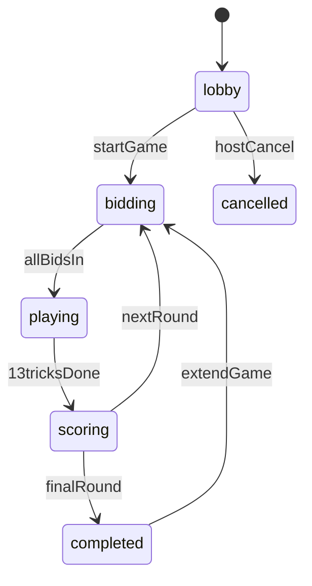
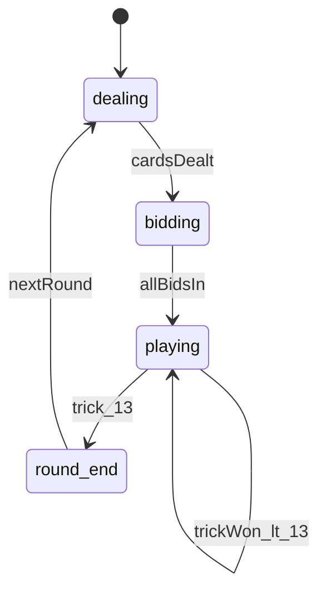

# ASAPDE Game — Architecture Document

**Version:** 1.0  
**Date:** July 3, 2026  
**Status:** Final  
**Parent:** `final_plan.md`  
**Product spec:** `asapde_game_prd.md`

This document defines the **full system split**: layers, modules, boundaries, data flows, API contracts, and design system mapping. Implementation must follow these boundaries.

---

## Table of Contents

1. [Architecture Principles](#1-architecture-principles)
2. [Layer Split (L1–L5)](#2-layer-split-l1l5)
3. [Repository Split](#3-repository-split)
4. [Client Architecture Split](#4-client-architecture-split)
5. [Server & API Split](#5-server--api-split)
6. [Engine Split (Domain Core)](#6-engine-split-domain-core)
7. [Realtime & Sync Split](#7-realtime--sync-split)
8. [Voice Split (LiveKit)](#8-voice-split-livekit)
9. [Storage Split](#9-storage-split)
10. [Data Model Split](#10-data-model-split)
11. [State Machine Split](#11-state-machine-split)
12. [Security Split](#12-security-split)
13. [Design System Split](#13-design-system-split)
14. [Screen → Component Split](#14-screen--component-split)
15. [Deployment Split](#15-deployment-split)
16. [Dependency Graph](#16-dependency-graph)

---

## 1. Architecture Principles

| # | Principle | Implication |
|---|-----------|-------------|
| P1 | **Server authority** | Deck, shuffle, validation, scoring only on server |
| P2 | **Thin client** | Client renders state + sends intent; no rule logic |
| P3 | **Dual mode isolation** | Manual and live share shell; diverge at play phase only |
| P4 | **Engine purity** | `aspade_game/engine` has zero React/Next imports |
| P5 | **Realtime is notify** | WebSocket = push hint; HTTP GET = source of truth on reconnect |
| P6 | **Mobile-first shell** | `100dvh`, safe areas, touch targets before desktop polish |
| P7 | **Progressive enhancement** | Polling works without Realtime; voice optional |

---

## 2. Layer Split (L1–L5)

```
┌─────────────────────────────────────────────────────────────────────────┐
│ L5 — External Services                                                  │
│   Supabase Realtime │ LiveKit Cloud │ S3 / FTP / Local FS              │
└───────────────────────────────────┬─────────────────────────────────────┘
                                    │
┌───────────────────────────────────▼─────────────────────────────────────┐
│ L4 — Persistence                                                        │
│   Game JSON files │ Player profiles │ Session records                   │
└───────────────────────────────────┬─────────────────────────────────────┘
                                    │
┌───────────────────────────────────▼─────────────────────────────────────┐
│ L3 — Domain Engine (aspade_game/engine)                                 │
│   SpadesEngine │ Rules │ Scoring │ State machine                        │
└───────────────────────────────────┬─────────────────────────────────────┘
                                    │
┌───────────────────────────────────▼─────────────────────────────────────┐
│ L2 — Application Services (Next.js API routes)                          │
│   Action handler │ Game reader │ Voice token │ Broadcast publisher      │
└───────────────────────────────────┬─────────────────────────────────────┘
                                    │
┌───────────────────────────────────▼─────────────────────────────────────┐
│ L1 — Presentation (React PWA)                                           │
│   Screens │ Card table │ Hooks │ Mobile wrapper │ PWA shell             │
└─────────────────────────────────────────────────────────────────────────┘
```

### Layer responsibilities

| Layer | Owns | Must NOT |
|-------|------|----------|
| L1 | UI, gestures, animations, local optimistic state | Shuffle, validate plays, persist game |
| L2 | AuthZ checks, orchestration, hand filtering, broadcast | Spades rule details (delegate to L3) |
| L3 | All Spades rules, state transitions, scoring math | HTTP, WebSocket, filesystem |
| L4 | Serialize/deserialize game JSON | Business logic |
| L5 | Transport only | Game state interpretation |

---

## 3. Repository Split

```
deploy_spade/
├── aspade_game/                          # DOCS + DOMAIN SANDBOX
│   ├── plan/
│   │   ├── final_plan.md                 # Execution plan
│   │   └── Architect.md                  # This file
│   ├── design/                           # UI mockups (reference)
│   ├── engine/                           # L3 — pure TS (source of truth)
│   │   ├── types.ts
│   │   ├── deck.ts
│   │   ├── deal.ts
│   │   ├── legal-plays.ts
│   │   ├── trick-resolver.ts
│   │   ├── bidding.ts
│   │   ├── scorer.ts
│   │   ├── state-machine.ts
│   │   ├── index.ts                      # SpadesEngine export
│   │   └── __tests__/
│   ├── components/table/                 # L1 prototypes → copied to front
│   └── hooks/                            # useGameSync, useAudioFX prototypes
│
└── aspade_railway/front/                 # L1 + L2 — DEPLOYABLE APP
    ├── app/
    │   ├── api/
    │   │   ├── action/route.ts           # L2 orchestrator
    │   │   ├── game/[gameId]/route.ts    # L2 reader + hand filter
    │   │   └── voice/token/route.ts      # L2 LiveKit JWT
    │   └── games/[gameId]/page.tsx
    ├── components/
    │   ├── card-table/                   # L1 live play (integrated from aspade_game)
    │   ├── game-screen.tsx               # L1 router: manual vs live
    │   └── ... (existing manual screens)
    └── lib/
        ├── spades-engine.ts              # Re-export from aspade_game/engine
        ├── realtime.ts                   # L1/L2 Supabase client wrapper
        └── game-utils.ts                 # Shared Game types
```

### Import rule

```
front/lib/spades-engine.ts  →  re-exports aspade_game/engine
front/app/api/*             →  imports from lib/spades-engine.ts
aspade_game/engine/*        →  imports NOTHING from front/
```

---

## 4. Client Architecture Split

### 4.1 Client subsystems

```
┌─────────────────────────────────────────────────────────────┐
│                    GameScreen (orchestrator)                 │
├──────────────┬──────────────────────┬───────────────────────┤
│ Session Mgr  │  Connectivity Mgr    │  Phase Router         │
│ mini-login   │  GamePoller          │  lobby → bid → play   │
│ ios-chrome   │  useGameSync         │  → score → complete   │
└──────────────┴──────────────────────┴───────────────────────┘
                              │
              ┌───────────────┴───────────────┐
              ▼                               ▼
     ┌─────────────────┐            ┌─────────────────┐
     │  MANUAL PATH    │            │   LIVE PATH     │
     │  BiddingScreen  │            │   CardTable     │
     │  TrickTracking  │            │   PlayerHand    │
     │  TrickReview    │            │   TrickZone     │
     └────────┬────────┘            └────────┬────────┘
              │                               │
              └───────────────┬───────────────┘
                              ▼
                    ┌─────────────────┐
                    │ LeaderboardScreen│
                    │ Celebrations     │
                    └─────────────────┘
```

### 4.2 Client modules

| Module | Path | Responsibility |
|--------|------|----------------|
| **Shell** | `mobile-game-wrapper.tsx` | dvh, safe area, touch |
| **Session** | `ios-chrome-session-manager.tsx`, `lib/api.ts` sessionStorage | Persist playerId/gameId |
| **Sync** | `hooks/useGameSync.ts`, `lib/api.ts` GamePoller | Realtime + polling |
| **Router** | `game-screen.tsx` | Phase + playMode branching |
| **Manual UI** | bidding/trick/leaderboard screens | Unchanged |
| **Live UI** | `components/card-table/*` | Table, hand, trick zone |
| **Audio** | `hooks/useAudioFX.ts` | Web Audio unlock + FX |
| **Voice** | `components/voice/*` | LiveKit room UI |

### 4.3 Phase router logic

```typescript
// game-screen.tsx — conceptual split
function renderPhase(game: Game, playMode: 'manual' | 'live') {
  switch (game.status) {
    case 'lobby':       return <GameLobby />
    case 'bidding':     return <BiddingScreen />
    case 'playing':
      return playMode === 'live'
        ? <CardTable />
        : <TrickTrackingScreen />
    case 'trick_review': return <TrickReviewModal />  // manual only
    case 'scoring':
    case 'completed':   return <LeaderboardScreen />
  }
}
```

### 4.4 Client state split

| State type | Where | Examples |
|------------|-------|----------|
| **Server state** | Fetched `game` object | Scores, phase, turns, public trick |
| **Private state** | `game.liveState.myHand` | Player's 13 cards only |
| **Optimistic** | React local | Card mid-animation before ACK |
| **UI ephemeral** | Component useState | Modals, toasts, glow effects |
| **Session** | localStorage + server | playerId, gameId, playerName |

---

## 5. Server & API Split

### 5.1 API surface

| Route | Layer | Methods | Purpose |
|-------|-------|---------|---------|
| `/api/create` | L2 | POST | Create game + host player |
| `/api/join` | L2 | POST | Join lobby, assign team |
| `/api/action` | L2 | POST | All game mutations |
| `/api/game/[gameId]` | L2 | GET | Sanitized game snapshot |
| `/api/voice/token` | L2 | POST | LiveKit JWT |
| `/api/session/*` | L2 | * | Session backup (existing) |

### 5.2 Action handler split (`/api/action`)

```
POST /api/action
    │
    ├─ Load game JSON (L4)
    ├─ Authorize: playerId in game, correct phase
    │
    ├─ IF playMode === 'manual'
    │     └─ Existing handlers (submitBid, submitTricks, approveTricks, ...)
    │
    └─ IF playMode === 'live'
          ├─ SpadesEngine.apply(game, action)  (L3)
          ├─ Save game JSON (L4)
          └─ broadcastGameEvent(gameId, events)  (L5)
```

### 5.3 Live actions (L2 → L3)

| Action | L2 checks | L3 handler |
|--------|-----------|------------|
| `startGame` | isHost, 4 players, lobby | `START_LIVE_GAME` → deal |
| `submitBid` | isTeamLeader or individual, bidding phase | `SUBMIT_BID` |
| `playCard` | isCurrentTurn, playing phase | `PLAY_CARD` |
| `nextRound` | isHost, scoring phase | `ADVANCE_ROUND` |
| `completeGame` | isHost | `COMPLETE_GAME` |

### 5.4 Hand filtering (L2 security boundary)

```typescript
// GET /api/game/[gameId]?playerId=xxx
function sanitizeForPlayer(game: Game, playerId: string): Game {
  if (game.playMode !== 'live' || !game.liveState) return game
  const { hands, ...publicLiveState } = game.liveState
  return {
    ...game,
    liveState: {
      ...publicLiveState,
      myHand: hands[playerId] ?? [],  // only requester's cards
    },
  }
}
```

**Never** send full `hands` map to client.

---

## 6. Engine Split (Domain Core)

### 6.1 Module dependency graph

```
types.ts
   │
   ├── deck.ts ──────────────┐
   ├── deal.ts ──────────────┤
   ├── legal-plays.ts ───────┼──► state-machine.ts ──► index.ts (SpadesEngine)
   ├── trick-resolver.ts ────┤
   ├── bidding.ts ───────────┤
   └── scorer.ts ────────────┘
```

### 6.2 Module contracts

| Module | Input | Output |
|--------|-------|--------|
| `deck.create()` | — | `Card[52]` |
| `deck.shuffle(cards, seed?)` | Card[] | Card[] |
| `deal.distribute(cards, seats)` | Card[], 4 seats | `Record<playerId, Card[]>` |
| `legal-plays.getLegal(hand, trick, spadesBroken)` | context | `Card[]` |
| `trick-resolver.winner(trick)` | 4 played cards | `{ winnerId, leadSuit }` |
| `bidding.validate(bid, context)` | number | void \| throw |
| `scorer.computeRound(round)` | bids + tricks | `Record<teamId, number>` |
| `state-machine.apply(game, action)` | Game, Action | `{ game, events[] }` |

### 6.3 SpadesEngine public API

```typescript
class SpadesEngine {
  static apply(game: Game, action: EngineAction): EngineResult

  static getLegalPlays(game: Game, playerId: string): string[]
  static validateAction(game: Game, action: EngineAction): void
}

interface EngineResult {
  game: Game
  events: GameEvent[]   // consumed by L2 for broadcast
}
```

### 6.4 Engine events (L3 → L2)

| Event | When |
|-------|------|
| `DEALT` | After start live game |
| `BID_SUBMITTED` | Each bid |
| `BIDDING_COMPLETE` | All bids in |
| `CARD_PLAYED` | Each card |
| `TRICK_COMPLETED` | 4th card of trick |
| `ROUND_COMPLETED` | 13th trick done |
| `PHASE_CHANGED` | Any phase transition |
| `GAME_COMPLETED` | Final round scored |

---

## 7. Realtime & Sync Split

### 7.1 Dual transport

```
                    ┌─────────────────┐
                    │     Client      │
                    └────────┬────────┘
                             │
              ┌──────────────┼──────────────┐
              ▼              ▼              ▼
     ┌────────────┐  ┌────────────┐  ┌────────────┐
     │  Primary   │  │  Fallback  │  │  Recovery  │
     │  Supabase  │  │ GamePoller │  │  Full GET  │
     │  broadcast │  │  HTTP poll │  │  snapshot  │
     └────────────┘  └────────────┘  └────────────┘
```

### 7.2 Channel config

```typescript
const channel = supabase.channel(`game:${gameId}`, {
  config: {
    broadcast: { self: false },
    presence: { key: playerId },
  },
})
```

### 7.3 Sync protocol

| Step | Actor | Action |
|------|-------|--------|
| 1 | Client | POST `/api/action` |
| 2 | L2 | Engine apply + save |
| 3 | L2 | `channel.send({ event: 'GAME_EVENT', payload })` |
| 4 | Clients | Receive event → refetch or merge delta |
| 5 | On WS drop | GamePoller activates (1.5s–5s adaptive) |
| 6 | On reconnect | GET `/api/game/[id]?playerId=` full snapshot |

### 7.4 Polling intervals (existing, retained)

| Phase | Interval |
|-------|----------|
| lobby | 3–5s |
| bidding | 2–3s |
| playing (my turn) | 1.5s |
| playing (not my turn) | 3s |
| scoring | 5s |

### 7.5 Presence split

| Field | Purpose |
|-------|---------|
| `playerId` | Presence key |
| `seat` | Table position |
| `onlineAt` | Timestamp |
| `status` | `online` \| `away` |

Lobby + card table show presence badges. Away if no heartbeat > 60s.

---

## 8. Voice Split (LiveKit)

### 8.1 Architecture

```
Client                          L2 API                    LiveKit Cloud
  │                               │                            │
  │── POST /api/voice/token ─────►│── sign JWT(room=gameId) ──►│
  │◄── { token, url } ────────────│                            │
  │                               │                            │
  │── WebRTC connect ─────────────────────────────────────────►│
  │◄── audio streams ──────────────────────────────────────────│
```

### 8.2 Voice module split

| Component | Layer | Role |
|-----------|-------|------|
| `/api/voice/token/route.ts` | L2 | Mint short-lived JWT |
| `VoiceRoomProvider.tsx` | L1 | `<LiveKitRoom room={gameId}>` |
| `VoiceControls.tsx` | L1 | Mute/unmute button |
| `VoiceIndicator.tsx` | L1 | Speaking halo on seat |

### 8.3 Voice rules

- Join room on game start (lobby opt-in checkbox)
- **Default muted** on join
- Room name = `gameId` (1:1 with game)
- Token TTL ≤ 6 hours
- No server-side recording v1

---

## 9. Storage Split

### 9.1 v1 persistence (unchanged)

| Entity | Path | Format |
|--------|------|--------|
| Game | `games/{gameId}.json` | Full Game object incl. `liveState.hands` |
| Player profile | `players/{name}.json` | Stats, history |
| Admin config | storage provider config | Existing |

### 9.2 Write path

```
L2 action handler
  → load JSON
  → L3 engine apply
  → save JSON (atomic write)
  → broadcast
```

### 9.3 Read path

```
L2 GET handler
  → load JSON
  → sanitize hands for playerId
  → return
```

### 9.4 v1.1 optional split

| Store | Contents |
|-------|----------|
| JSON (hot) | Active games |
| Postgres (cold) | Completed games, analytics, leaderboards |

Not in v1 scope.

---

## 10. Data Model Split

### 10.1 Public vs private fields

| Field | Visibility | Layer enforces |
|-------|------------|----------------|
| `game.players` | All clients | — |
| `game.rounds[].bids` | All (or hidden per config) | L2 |
| `game.liveState.currentTrick` | All | — |
| `game.liveState.hands` | **Server only** | L2 strips |
| `game.liveState.myHand` | Requester only | L2 adds |
| `game.scores` | All | — |

### 10.2 Core types

```typescript
// --- Game (extended) ---
interface Game {
  id: string
  playMode: 'manual' | 'live'
  status: GameStatus
  players: Record<string, Player>
  rounds: Round[]
  teamConfig?: TeamConfig
  liveState?: LiveState        // live only; hands server-side
}

// --- LiveState (server) ---
interface LiveState {
  phase: 'dealing' | 'bidding' | 'playing' | 'round_end'
  dealerSeat: number           // 0=N, 1=E, 2=S, 3=W
  seats: Record<string, number> // playerId → seat
  currentTurn: string | null
  turnExpiresAt: number | null
  spadesBroken: boolean
  currentTrick: Trick | null
  completedTricks: Trick[]
  tricksWon: Record<string, number>
  hands: Record<string, string[]>  // SERVER ONLY
}

// --- Client view ---
interface ClientLiveState extends Omit<LiveState, 'hands'> {
  myHand: string[]
}

// --- Card encoding ---
type CardCode = string  // "AS" | "10D" | "KH" | "2C"
```

### 10.3 Seat mapping

```
Seat 0 (North) ─── Partner of Seat 2
Seat 1 (East)  ─── Opponent
Seat 2 (South) ─── Self (default bottom UI)
Seat 3 (West)  ─── Opponent

Teams: (0,2) vs (1,3) when standard 4-player
```

UI rotates so **current player always renders at South (bottom)**.

---

## 11. State Machine Split

### 11.1 Game-level states



### 11.2 Live-only sub-states (`liveState.phase`)



### 11.3 Manual-only path

```
bidding → playing → trick_review → scoring
```

`trick_review` **does not exist** in live mode.

### 11.4 Transition ownership

| Transition | Owner |
|------------|-------|
| Rule-valid transitions | L3 Engine |
| Host overrides (extend, complete, edit) | L2 with host check |
| UI phase display | L1 reads `game.status` |

---

## 12. Security Split

| Threat | Layer | Mitigation |
|--------|-------|------------|
| Play out of turn | L3 | Reject action |
| Play illegal card | L3 | `legal-plays` check |
| See opponent cards | L2 | Hand filter on GET |
| Forge bid/play | L2 | playerId must match session |
| Replay action | L2 | Idempotency key or version check on game |
| Voice eavesdrop | L2 | JWT scoped to gameId + playerId |
| Client-side shuffle | L1 | Not implemented; server only |

---

## 13. Design System Split

### 13.1 Token split

| Token | Value | Usage |
|-------|-------|-------|
| `--table-felt` | `#1a472a` | Card table background |
| `--card-radius` | `8px` | Playing cards |
| `--safe-top` | `env(safe-area-inset-top)` | Header |
| `--safe-bottom` | `env(safe-area-inset-bottom)` | Hand area |
| Team colors | From `TEAM_COLORS` in create form | Badges, seats |

### 13.2 Layout tokens

| Breakpoint | Layout |
|------------|--------|
| < 375px | Compact hand scroll, stacked HUD |
| 375–428px | Standard mobile (design mockups) |
| ≥ 428px | Large mobile mode (existing wrapper) |
| ≥ 768px | Optional wider table; not v1 priority |

### 13.3 Motion split

| Animation | Library | Duration | Reduced motion |
|-----------|---------|----------|----------------|
| Card to trick | framer-motion | 300ms | Instant |
| Trick sweep | framer-motion | 400ms | Fade |
| Deal | framer-motion stagger | 500ms | Skip |
| Celebration | existing components | — | Existing |

### 13.4 Audio split

| Event | File | Trigger |
|-------|------|---------|
| Shuffle | `shuffle.mp3` | Deal |
| Card play | `play.mp3` | CARD_PLAYED |
| Trick win | `win.mp3` | TRICK_COMPLETED |
| Round win | Web Audio (existing) | Round celebration |

**Unlock:** `useAudioFX.unlock()` called on lobby **Start Game** tap.

### 13.5 Mockup → implementation map

| Mockup | Components |
|--------|------------|
| `spades_dashboard_*.png` | `dashboard.tsx` |
| `spades_game_lobby_*.png` | `game-lobby.tsx` + presence |
| `spades_bidding_*.png` | `bidding-screen.tsx` |
| `spades_card_table_*.png` | `CardTable`, `TableLayout`, `PlayerHand`, `TrickZone` |
| `spades_scoreboard_*.png` | `leaderboard-screen.tsx` |

---

## 14. Screen → Component Split

| Screen | Route | Components | Mode |
|--------|-------|------------|------|
| Login | `/` | `LoginScreen` | Both |
| Dashboard | `/dashboard` | `Dashboard`, `GameHistoryCard`, `MobileRecovery` | Both |
| Create | `/create-game` | `CreateGameForm` (+ playMode toggle) | Both |
| Join | `/quick-join/[id]` | `JoinGameForm`, `TeamSelectionModal` | Both |
| Game shell | `/games/[id]` | `GameScreen`, `MobileGameWrapper` | Both |
| Lobby | phase=lobby | `GameLobby` | Both |
| Bidding | phase=bidding | `BiddingScreen`, `GameHeader` | Both |
| **Live table** | phase=playing, live | `CardTable`, `PlayerHand`, `TrickZone`, `TableHUD` | Live |
| Trick entry | phase=playing, manual | `TrickTrackingScreen` | Manual |
| Review | phase=trick_review | `TrickReviewModal` | Manual |
| Score | phase=scoring | `LeaderboardScreen`, `FloatingScoreButton` | Both |
| Victory | phase=completed | `RoundCelebration`, `GameCompletionFireworks` | Both |

### CardTable internal split

```
CardTable/
├── TableLayout.tsx       # dvh shell, seat positions, rotation
├── TableHUD.tsx          # round, scores, turn, spades broken
├── Seat.tsx              # avatar, name, bid, trick count, presence
├── TrickZone.tsx         # 4 cards, framer-motion
├── PlayerHand.tsx        # sorted fan, scroll, legal highlight
├── PlayingCard.tsx       # SVG face, tap/drag handlers
├── VoiceControls.tsx     # mute (Phase 4)
└── ConnectionBadge.tsx   # sync status
```

---

## 15. Deployment Split

### 15.1 Environments

| Env | Host | Branch | Live mode |
|-----|------|--------|-----------|
| Dev | localhost:3000 | feature/* | flag on |
| Staging | Railway preview | `feat/live-spades` | flag on |
| Production | Railway | `main` | flag off → on at launch |

### 15.2 Env vars split

| Var | Layer | Purpose |
|-----|-------|---------|
| `SUPABASE_URL` | L2/L1 | Realtime |
| `SUPABASE_ANON_KEY` | L1 | Client subscribe |
| `SUPABASE_SERVICE_KEY` | L2 | Server broadcast |
| `LIVEKIT_URL` | L1/L2 | Voice |
| `LIVEKIT_API_KEY` | L2 | Token mint |
| `LIVEKIT_API_SECRET` | L2 | Token mint |
| `LIVE_MODE_ENABLED` | L2/L1 | Feature flag |
| Storage vars | L4 | Existing S3/FTP/local |

### 15.3 Build split

| Artifact | Tool |
|----------|------|
| Next.js app | `next build` |
| Engine tests | `vitest aspade_game/engine` |
| PWA SW | Serwist post-build |
| Card assets | `/public/cards/*.svg` |

---

## 16. Dependency Graph

```mermaid
flowchart TB
    subgraph L1 [L1 Client]
        GS[GameScreen]
        CT[CardTable]
        UGS[useGameSync]
        GP[GamePoller]
    end

    subgraph L2 [L2 API]
        ACT[/api/action]
        GET[/api/game/id]
        VOX[/api/voice/token]
        BC[broadcastGameEvent]
    end

    subgraph L3 [L3 Engine]
        SE[SpadesEngine]
        LP[legal-plays]
        TR[trick-resolver]
    end

    subgraph L4 [L4 Storage]
        JSON[(game JSON)]
    end

    subgraph L5 [L5 External]
        SB[Supabase RT]
        LK[LiveKit]
    end

    GS --> CT
    GS --> UGS
    GS --> GP
    CT --> ACT
    UGS --> SB
    GP --> GET
    ACT --> SE
    SE --> LP
    SE --> TR
    ACT --> JSON
    GET --> JSON
    ACT --> BC
    BC --> SB
    VOX --> LK
    CT --> VOX
```

---

## Appendix — Implementation Order

Build strictly in this order to respect layer dependencies:

1. **L3** — `types.ts`, `deck.ts`, tests  
2. **L3** — `legal-plays`, `trick-resolver`, `state-machine`, full test suite  
3. **L2** — Wire engine into `/api/action` for live actions  
4. **L2** — Hand filtering on GET  
5. **L2** — Supabase broadcast after save  
6. **L1** — `useGameSync` + GamePoller coexistence  
7. **L1** — `CardTable` components (static, then wired)  
8. **L1** — Phase router in `game-screen.tsx`  
9. **L5** — LiveKit token + voice UI  
10. **L1** — PWA Serwist + asset cache  

---

*Architecture owner: Engineering*  
*Changes require update to `final_plan.md` if scope/phases affected*
